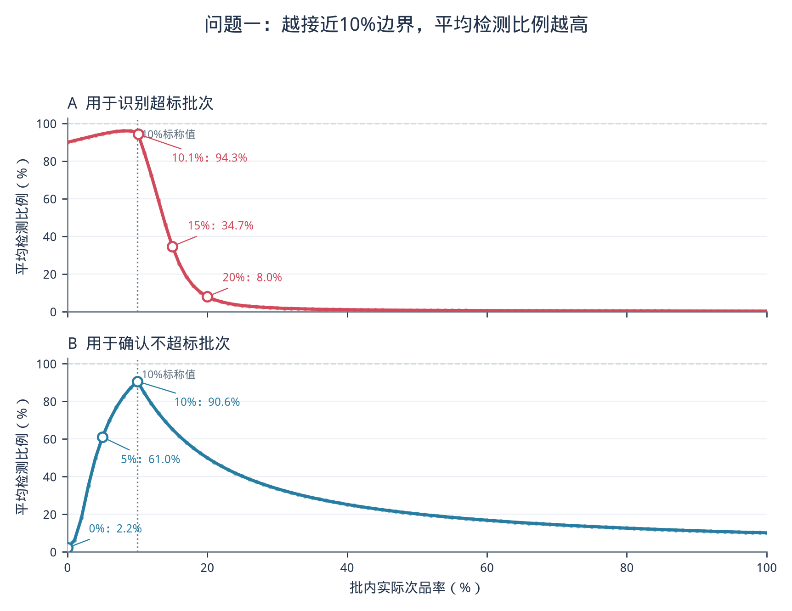

# 问题一：有限总体完整动作空间序贯抽样模型的建立与求解

## 1 问题重述

供应商声称某批零配件的次品率不超过标称值 10%。企业需要设计检测次数尽可能少的抽样
方案，并分别处理两个情景：在 95% 的信度下认定次品率超过 10% 时拒收；在 90% 的信度下
认定次品率不超过 10% 时接收。

题目没有给出批量，也没有提供已经取得的样本。因此，模型不能输出一个对所有批次都相同
的固定检测数，而应在企业输入本批总件数后生成逐件检测、边检边判的序贯规则。

有限批次会带来两类确定性的边界事实：一旦已经发现的次品数超过不超标上限，整批必然
超标；即使剩余全部未检件都是次品，整批仍不超标，则整批必然合格。这两类结论不消耗
任何统计信度，应在两个情景中都立即停止。模型把统计阈值动作与这两类零风险事实动作
组合成完整动作空间。

## 2 问题分析

抽样过程中，每批零件的实际排列不同，达到充分证据所需的检测数也会不同。故本文以停止
时刻的期望，即平均检测次数，评价方案成本。每条实际路径仍只会检测整数件，平均值则可
以是小数。

两个题定情景的证据方向相反。第一种情景在超标证据充分时拒收；第二种情景在不超标证据
充分时接收。把两者合为一次双向判断，会把 95% 和 90% 错误地绑定到同一程序中，因此本文
分别建立两套统计模型。但两套模型共享同一组零风险事实动作：事实拒收与事实接收不占用
任何一方的统计错误预算，因而可以同时生效。

由于抽样对象是一批件数有限、抽后不放回的零件，后续观测概率会随已检结果改变。模型
采用有限总体超几何关系，而不把各次检测视为相互独立的二项试验。

## 3 模型假设

1. 从尚未检测的零件中等概率抽取一件，且抽取后不放回。
2. 单件检测结果准确，抽样期间不换批、不混批，整批真实次品数保持不变。
3. 抽样前确定执行拒收情景或接收情景，不能根据中途结果切换情景。
4. 序贯规则只使用整批件数、已检件数和已发现次品数，不利用零件编号等无关信息。
5. 事实动作由有限批次剩余容量直接推出，不依赖任何质量先验或额外参数。

这些假设是概率保证的适用条件。若存在误检、缺陷聚集或人为挑样，应重新建立观测模型，
不能直接沿用本文阈值。

## 4 主要符号说明

| 符号 | 含义 | 取值或单位 |
|---|---|---|
| `N` | 当前批次总件数 | 正整数，件 |
| `D` | 整批真实次品数，固定但未知 | `0,1,...,N`，件 |
| `D0` | 不超过 10% 的最大整数次品数 | 件 |
| `D1` | 超过 10% 的最小整数次品数 | 件 |
| `t` | 当前已经检测的件数 | `0,1,...,N`，件 |
| `X_t` | 前 `t` 件中累计发现的次品数 | 件 |
| `r_t` | 情景一第 `t` 时刻的统计拒收阈值 | 整数或 `t+1` |
| `a_t` | 情景二第 `t` 时刻的统计接收阈值 | 整数或 `-1` |
| `T_R` | 拒收情景的停止检测件数 | 件 |
| `T_A` | 接收情景的停止检测件数 | 件 |

## 5 模型建立

### 5.1 标称率对应的有限总体整数边界

次品数只能取整数。设 `N` 为企业输入的整批件数，`D0` 为仍不超过 10% 的最大整数
次品数，`D1` 为刚刚超过 10% 的最小整数次品数，`floor` 表示向下取整，则有

```text
D0 = floor(N/10)，D1 = D0 + 1。                                      （1）
```

式（1）把标称率转换为有限批次上的相邻整数边界。例如 `N=23` 时，`D0=2`、`D1=3`。
这里的 `D1` 不是额外设定的劣质质量水平，而是 10% 在整数网格上的直接结果。

### 5.2 无放回抽样的状态关系

设整批共有 `N` 件，其中真实次品数为 `D`；检测完前 `t` 件后，共发现 `x` 件
次品，即当前状态为 `X_t=x`。从 `D` 件次品和 `N-D` 件合格品中无放回抽取 `t`
件，恰好抽到 `x` 件次品的概率为

```text
P_D(X_t=x) = C(D,x)C(N-D,t-x) / C(N,t)。                              （2）
```

式（2）中，`P_D` 表示在整批真实有 `D` 件次品的条件下计算概率，`C(u,v)` 表示从
`u` 个对象中选取 `v` 个。此时累计次品数必须满足
`max(0,t-N+D)<=x<=min(t,D)`；该范围之外的状态不可能到达。式（2）描述可达计数状态的
有限总体概率。

若 `t<N`，尚未检测的共有 `N-t` 件，其中剩余次品 `D-x` 件，剩余合格品
`N-D-t+x` 件。因此下一件的两种结果满足

```text
P_D(下一件为次品 | X_t=x) = (D-x)/(N-t)，                            （3）
P_D(下一件为合格品 | X_t=x) = (N-D-t+x)/(N-t)。                      （4）
```

式（3）和式（4）的和为 1。它们会随已见次品数 `x` 改变，这正是不能采用独立二项抽样
模型的原因。检测到 `t=N` 时已经全检，不再使用这两式。

### 5.3 平均检测次数

设某个序贯规则在一条具体抽样路径上检测 `T` 件后停止。在整批真实次品数为 `D` 时，
对所有随机排列下的停止件数取期望，定义该规则的平均检测次数为

```text
ASN(D) = E_D[T]。                                                       （5）
```

式（5）中，`E_D` 表示在整批真实有 `D` 件次品时取平均。`T` 在每条路径上都是整数，
`ASN(D)` 是大量同类批次长期执行的平均成本，所以可以为小数。

### 5.4 零风险事实动作

设当前状态为已检 `t` 件、发现 `x` 件次品，`0<=t<N`。由式（1）的边界直接推出
两类必然结论：

```text
事实拒收：x >= D1；                                                （6）
事实接收：x + (N-t) <= D0。                                        （7）
```

式（6）说明已见次品数已经超过不超标上限，整批必然超标，立即拒收；式（7）说明即使
剩余 `N-t` 件全部是次品，整批次品数仍不超过 `D0`，整批必然合格，立即接收。
两条件不可能同时成立：`x>=D1>D0` 与 `x<=D0-(N-t)<=D0` 互斥。

这两类停止由有限总体剩余容量直接推出，错误概率严格为零，因此不占用情景一 5% 或情景二
10% 的统计错误预算。事实动作在任一情景、任一时刻都优先于统计阈值动作。

### 5.5 情景一：95% 信度下的提前拒收模型

#### 5.5.1 阈值与停止规则

情景一在事实动作之上叠加统计拒收。设 `r_t` 为第 `t` 个时刻触发统计拒收所需的最少
次品数，则状态 `(t,x)` 的完整动作规则为

```text
x + (N-t) <= D0   => 事实接收，停止；
x >= D1           => 事实拒收，停止；
x >= r_t          => 统计拒收，停止；
否则              => 继续检测。
```

事实接收优先：即使某状态同时满足统计拒收条件，整批已必然合格，仍按事实接收停止。
为消除与事实边界重复的编码，`r_t` 只在规范域

```text
r_t ∈ {0,...,min(t,D0)} ∪ {t+1}                                      （8）
```

中取值，其中 `r_t=t+1` 表示该时刻不设置统计拒收动作。由于 `min(t,D0)<D1`，任何
统计拒收阈值都不会越过事实拒收边界。

设 `T_R` 为第一次触发任一拒收（统计或事实）时已经检测的件数；若全检前从未拒收，
则 `T_R=N`，此时按整批真实次品数作事实判定。

#### 5.5.2 风险约束与优化目标

情景一的错误是"不超标批次被提前拒收"。对 `D<=D0`，事实拒收不可达，`T_R<N`
只可能来自统计拒收，因此程序级风险要求为

```text
max_{D=0,...,D0} P_D(T_R<N) <= 0.05。                                 （9）
```

式（9）限制的是从第一次抽样到最终停止的累计错误早拒概率，不能在每个时刻重复使用一次
5% 的局部尾概率。

满足式（9）后，还要尽量减少真正超标批次的检测次数。设 `E_D[T_R]` 为真实次品数为
`D` 时的平均检测次数，则拒收模型的原始优化目标为

```text
在满足式（9）的阈值表中，最小化 max_{D=D1,...,N} E_D[T_R]。         （10）
```

#### 5.5.3 最坏批次的边界化

将一批含 `D` 件次品的零件随机排成一列，再把其中一个合格品改成次品，就得到含
`D+1` 件次品的批次。设 `X_t(D)` 和 `X_t(D+1)` 分别表示同一排列下两批零件在前
`t` 个位置累计发现的次品数，则每条路径都满足

```text
X_t(D) <= X_t(D+1)，t=0,1,...,N。                                     （11）
```

在目标侧 `D>=D1`，事实接收不可达，所有停止都是拒收；拒收条件是累计次品数达到上
阈值，因此增加一件次品只可能使拒收更早。于是错误早拒概率随 `D` 增加而不下降，
目标侧平均检测次数随 `D` 增加而不增加：

```text
max_{D=0,...,D0} P_D(T_R<N) = P_D0(T_R<N)，                            （12）
max_{D=D1,...,N} E_D[T_R] = E_D1[T_R]。                               （13）
```

式（12）说明风险只需在 `D0` 处检查，式（13）说明目标只需在 `D1` 处计算。全 D
曲线在跨过边界后会混入事实接收停止，因此不再声称整体单调，但目标侧最坏点仍由式（13）
固定。

### 5.6 情景二：90% 信度下的提前接收模型

#### 5.6.1 阈值与停止规则

情景二在事实动作之上叠加统计接收。设 `a_t` 为第 `t` 个时刻仍允许统计接收的最大
次品数，则状态 `(t,x)` 的完整动作规则为

```text
x >= D1           => 事实拒收，停止；
x + (N-t) <= D0   => 事实接收，停止；
x <= a_t          => 统计接收，停止；
否则              => 继续检测。
```

与式（8）对称，`a_t` 只在规范域

```text
a_t ∈ {-1} ∪ {max(0,t-(N-D0)+1),...,min(t,D0)}                      （14）
```

中取值，其中 `a_t=-1` 表示该时刻不设置统计接收动作。式（14）的下界
`t-(N-D0)+1` 保证任何 `a_t` 都不会覆盖事实接收已必然停止的状态，避免重复编码。

设 `T_A` 为第一次触发任一接收（统计或事实）时已经检测的件数；若全检前从未接收，
则 `T_A=N`，此时按整批真实次品数作事实判定。

#### 5.6.2 风险约束与优化目标

情景二的错误是"超标批次被提前接收"。对 `D>=D1`，事实接收不可达，`T_A<N` 只可能
来自统计接收，因此程序级风险要求为

```text
max_{D=D1,...,N} P_D(T_A<N) <= 0.10。                                 （15）
```

式（15）单独落实 90% 信度要求，与情景一的 5% 风险没有联合使用。

满足式（15）后，需要减少不超标批次的检测次数。设 `E_D[T_A]` 为真实次品数为 `D`
时的平均检测次数，则接收模型的原始优化目标为

```text
在满足式（15）的阈值表中，最小化 max_{D=0,...,D0} E_D[T_A]。        （16）
```

#### 5.6.3 最坏批次的边界化

式（11）的共同排列关系同样适用于情景二。在目标侧 `D<=D0`，事实拒收不可达，所有
停止都是接收；接收条件是累计次品数不超过下阈值，因此增加一件次品只可能使提前接收
更难。错误早接概率随 `D` 增加而不增加，目标侧平均检测次数随 `D` 增加而不下降：

```text
max_{D=D1,...,N} P_D(T_A<N) = P_D1(T_A<N)，                            （17）
max_{D=0,...,D0} E_D[T_A] = E_D0[T_A]。                               （18）
```

式（17）说明风险只需在 `D1` 处检查，式（18）说明目标只需在 `D0` 处计算。

### 5.7 两个模型的输出形式

给定实际批量 `N` 后，模型分别输出完整拒收阈值表 `r_1,...,r_{N-1}` 和完整接收
阈值表 `a_1,...,a_{N-1}`，并报告各自的边界风险、目标侧平均检测次数、严格下界和
最优性证书。两张阈值表必须分开执行；事实动作（式（6）、式（7））在两表中均自动生效，
不能先观察再选择对企业有利的动作。

## 6 模型求解

### 6.1 求解思路

完整阈值表的组合数随批量迅速增长，主算法不逐张遍历全部方案，而依次完成三项工作：

1. 利用无放回转移关系精确计算一张阈值表的风险（分方向）和平均检测次数；
2. 从零风险事实基线出发逐步改进阈值，得到可执行方案及平均检测次数上界；
3. 通过状态放宽和分支定界计算严格下界，用上下界差距判断能否证明阈值类全局最优。

以下先给出三值动作的概率递推，再说明共同的上下界求解方法。

### 6.2 三值动作的递推结构

任一状态 `(t,x)` 的动作取三值之一：继续、接收、拒收。设 `z^A(t,x)` 与
`z^R(t,x)` 分别为该状态是否接收、是否拒收的指示量，则对任意真实次品数 `D`，按
式（6）、式（7）与情景阈值可直接确定

```text
z^A(t,x) = 1{x+(N-t)<=D0 或 (情景二且 x<=a_t)}，                      （19）
z^R(t,x) = 1{x>=D1 或 (情景一且 x>=r_t)}。                            （20）
```

式（19）与式（20）中的 `1{条件}` 是指示函数，条件成立取 1，否则取 0。两式互斥：
事实接收与事实拒收不可能同时成立，统计阈值域又避开了事实边界，因此每状态至多触发
一种停止。

设 `q(D,t,x)` 表示整批真实有 `D` 件次品时，到达"已检 `t` 件、已见 `x` 件
次品"且此前尚未停止的概率。抽样开始时唯一状态的概率为 1：

```text
q(D,0,0) = 1。                                                          （21）
```

当 `t<N` 时，只有尚未停止的质量 `q(D,t,x)[1-z^A(t,x)-z^R(t,x)]` 才继续传播。
结合式（3）和式（4），下一件为次品与合格品的递推分别为

```text
q(D,t+1,x+1) += q(D,t,x)[1-z^A-z^R](D-x)/(N-t)，                     （22）
q(D,t+1,x)   += q(D,t,x)[1-z^A-z^R](N-D-t+x)/(N-t)。                 （23）
```

式（22）和式（23）中，`N` 是整批件数，`D` 是整批真实次品数，`t` 和 `x` 分别
是当前已检件数和已见次品数。

设 `Stop(D)` 为全检前任意方向提前停止的总概率，`Stop_A(D)` 与 `Stop_R(D)`
分别为其中接收型与拒收型的概率。每个状态的到达概率乘以对应指示量并求和，得到

```text
Stop_A(D) = Σ_{t=1}^{N-1} Σ_{x=0}^{t} q(D,t,x)z^A(t,x)，             （24）
Stop_R(D) = Σ_{t=1}^{N-1} Σ_{x=0}^{t} q(D,t,x)z^R(t,x)，             （25）
Stop(D) = Stop_A(D) + Stop_R(D)。                                     （26）
```

设 `ASN(D)` 为真实次品数为 `D` 时的平均检测次数。每个早停概率用其停止时刻 `t`
加权，未提前停止的剩余概率检测完整批 `N` 件，因此

```text
ASN(D) = Σ_{t=1}^{N-1} t[Σ_{x=0}^{t}q(D,t,x)z^A(t,x)+Σ_{x=0}^{t}q(D,t,x)z^R(t,x)]
         + N[1-Stop(D)]。                                             （27）
```

对任一情景和任一真实次品数，`Stop(D)+[1-Stop(D)]=1` 且
`Stop_A(D)+Stop_R(D)=Stop(D)` 必须成立。这两个概率质量守恒条件用于检查式（22）至
式（27）的概率递推是否遗漏路径或混淆动作方向。

### 6.3 情景一的风险与平均检测次数

由式（12），情景一只需在 `D0` 处检查风险。对 `D<=D0`，式（6）的事实拒收不可达，
情景一又无统计接收，故式（25）的 `Stop_R(D)` 就是式（9）中的 `P_D(T_R<N)`：

```text
P_D0(T_R<N) = Stop_R(D0) <= 0.05。                                    （28）
```

由式（13），目标只需在 `D1` 处计算；该侧事实接收不可达，`Stop(D1)=Stop_R(D1)`：

```text
max_{D>=D1} E_D[T_R] = ASN(D1)。                                       （29）
```

### 6.4 情景二的风险与平均检测次数

由式（17），情景二只需在 `D1` 处检查风险。对 `D>=D1`，式（7）的事实接收不可达，
情景二又无统计拒收，故式（24）的 `Stop_A(D)` 就是式（15）中的 `P_D(T_A<N)`：

```text
P_D1(T_A<N) = Stop_A(D1) <= 0.10。                                    （30）
```

由式（18），目标只需在 `D0` 处计算；该侧事实拒收不可达，`Stop(D0)=Stop_A(D0)`：

```text
max_{D<=D0} E_D[T_A] = ASN(D0)。                                       （31）
```

### 6.5 可行方案与上界

求解先构造零风险基线：情景一取 `r_t=t+1`（不设统计拒收），情景二取 `a_t=-1`
（不设统计接收），只保留式（6）、式（7）的事实动作。该基线在两情景下的方向风险均为 0。

在安全基线基础上，算法逐时刻尝试规范域内的其他整数阈值。每次改变后，都由式（19）至
式（27）精确复算方向风险与目标侧平均检测次数；只有风险仍满足相应上限且目标平均次数
下降，才接受这次改变。由此得到的阈值表已经满足全部约束，其平均检测次数记为可行上界
`UB`。

上界只说明"已经存在一个方案能做到 `UB`"，不能单独排除更小的可行平均检测次数。

若若干确定性阈值表具有完全相同的精确平均检测次数，则把所有时刻和计数状态按固定顺序
排列，并在相同目标值中选择动作向量字典序最小的方案。该规则只消除计算输出的不唯一性，
不改变风险约束或企业成本目标。

### 6.6 状态放宽给出的严格下界

为判断候选方案还能改善多少，暂时取消"同一时刻必须使用一条整数阈值"的限制，允许每个
未决状态独立选择方向动作或继续。事实状态（式（6）、式（7））仍强制停止，且方向事实
动作计入风险罚项、反方向事实动作只计停止时间。放宽后的可选动作更多，其最优平均检测
次数不会高于原阈值模型的最优值，因而能够提供严格下界。

#### 6.6.1 共同似然权重

取每一步次品、合格概率均为 `1/2` 的二叉序列作为统一参考。设 `N` 为整批件数，
`D` 为整批真实次品数，`t` 为已经检测的件数，`x` 为其中次品数。再定义下降阶乘
`falling(u,k)=u(u-1)...(u-k+1)`，并规定 `falling(u,0)=1`。真实无放回前缀相对参考
序列的似然权重为

```text
L_D(t,x) = 2^t falling(D,x)falling(N-D,t-x) / falling(N,t)。          （32）
```

式（32）中的 `L_D(t,x)` 把同一计数状态在不同真实次品总数下的概率换算到同一参考
树上；不可能出现的前缀权重记为 0。

#### 6.6.2 情景一的动态规划下界

设 `lambda` 为任意非负风险罚价，`D0` 和 `D1` 分别是不超标、超标的相邻整数边界。
下面一式中的 `ASN(D1)` 是目标侧平均检测次数，`Stop_R(D0)` 是错误早拒概率。二者
组合为

```text
ASN(D1) + lambda[Stop_R(D0)-0.05]。                                   （33）
```

设 `V_R(t,x)` 为从"已检 `t` 件、已见 `x` 件次品"开始，在放宽动作类中能够取得的
最小加权代价。`N` 仍表示整批件数；式（32）的 `L_D1(t,x)` 为目标批次权重，
`L_D0(t,x)` 为风险批次权重。在全检时只能支付完整检测件数；事实接收态只计停止时间；
事实拒收态计入风险罚项；未决状态在统计拒收与继续检测之间取最小：

```text
V_R(N,x) = N L_D1(N,x)，                                               （34）

事实接收态代价 = tL_D1(t,x)，
事实拒收态代价 = tL_D1(t,x) + lambda L_D0(t,x)，
统计拒收代价   = tL_D1(t,x) + lambda L_D0(t,x)，
继续检测代价   = [V_R(t+1,x)+V_R(t+1,x+1)]/2，

V_R(t,x) = 各可用动作代价的最小值，1<=t<N。                          （35）
```

根状态不允许未检一件就拒收，因此 `V_R(0,0)` 只取两个下一状态代价的平均。将式（33）
中的风险限额常数扣回，得到该罚价对应的拒收模型下界

```text
g_R(lambda) = V_R(0,0) - 0.05lambda。                                 （36）
```

#### 6.6.3 情景二的动态规划下界

情景二单独使用 10% 风险限额。仍设 `lambda` 为非负风险罚价，目标侧为 `D0`，风险侧
为 `D1`，二者组合为

```text
ASN(D0) + lambda[Stop_A(D1)-0.10]。                                   （37）
```

设 `V_A(t,x)` 为情景二从状态"已检 `t` 件、已见 `x` 件次品"开始，在放宽动作类中
的最小加权代价。事实拒收态只计停止时间；事实接收态计入风险罚项；未决状态在统计接收
与继续检测之间取最小：

```text
V_A(N,x) = N L_D0(N,x)，                                               （38）

事实拒收态代价 = tL_D0(t,x)，
事实接收态代价 = tL_D0(t,x) + lambda L_D1(t,x)，
统计接收代价   = tL_D0(t,x) + lambda L_D1(t,x)，
继续检测代价   = [V_A(t+1,x)+V_A(t+1,x+1)]/2，

V_A(t,x) = 各可用动作代价的最小值，1<=t<N。                          （39）
```

根状态同样不允许零检测接收。扣除式（37）中的风险限额常数，得到接收模型下界

```text
g_A(lambda) = V_A(0,0) - 0.10lambda。                                 （40）
```

对于满足风险约束的任一方案，式（33）或式（37）中的"风险减限额"不大于 0，乘以非负
`lambda` 后不会高于原平均检测次数；动态规划又在更宽的动作类中取最小值。因此
`g_R(lambda)` 和 `g_A(lambda)` 分别是两种情景的严格下界。对不同非负罚价取最大值，
可以在不破坏下界有效性的前提下把它收紧。

### 6.7 阈值类分支定界与停止判据

状态放宽允许同一时刻的不同计数状态各自行动，所得下界可能偏低。为把证明收紧到企业
实际采用的整数阈值类，算法按一个完整时刻的阈值进行分支：已固定时刻严格执行指定阈值，
未固定时刻仍允许未决状态独立行动（事实状态始终强制停止）。

若一个分支能够达到的最小风险已经超过限额，该分支不可能可行；若它理论上最小的平均
检测次数仍不低于当前可行上界，该分支不可能产生更优方案。只有剩余分支才继续细分。

设 `UB` 为当前可行方案的平均检测次数，`LB` 为所有未排除分支仍共同保证的严格下界，
则尚未排除的最大改进空间为

```text
gap = UB - LB。                                                         （41）
```

当前沿全部关闭且 `gap=0` 时，当前方案在确定性计数阈值类中全局最优；若计算资源到限时
仍有 `gap>0`，则只报告可行上界、严格下界和差距。该停止规则把"求得一个好方案"与
"已经证明没有更好方案"严格区分开来。

一次固定阈值表的概率递推和一个罚价下的动态规划都只需处理约 `N^2` 个计数状态。分支
定界的最坏规模仍可能随 `N` 指数增长，但风险剪枝和下界剪枝避免把完整遍历作为常规
求解方法。

## 7 模型结果

题面没有指定实际批量，因此通用答案是"输入 `N` 后生成两张阈值表"，而不是一个固定
常量。以下先给出`N=1000`时不同质量状态下的检测效率，再分别报告`N=10、23、50`的
阈值结构和最优性证书，并补充`N=100、200、500、1000`在10%相邻边界状态下的计算结果。
所有批量均为计算夹具，不是题面给定或企业实测批量。

### 7.1 不同质量状态下的平均检测效率

固定代表性批量`N=1000`，采用已经确定且通过风险核对的两套阈值规则，分别改变批内真实
次品数`D`，并由有限总体概率递推计算平均检测比例。拒收情景主要评价10%以上批次的提前
拒收效率，接收情景主要评价10%以下批次的提前接收效率。相对全检节省比例定义为
`1-ASN/N`。

这里的真实次品数`D`只用于事后评价方案，企业实际抽样时并不知道`D`，已经确定的接收、
拒收阈值也不会随`D`改变。直观地说，拒收方案能够提前停止，确实是因为次品率较高的批次
在检测前段更容易较快发现多件次品；但现场判断并不是先知道整批次品率，而是检查截至第
`t`件已经发现的次品数`X_t`是否达到拒收阈值`r_t`。同理，次品率较低时，前段抽样更容易
保持“少次品”的状态，`X_t`便可能较早落入接收阈值`a_t`所规定的范围。

因此，`D`改变的不是判定规则，而是不同抽样过程出现的可能性，进而改变平均停止时间。
例如，当`N=1000、D=200`时，前段样本较快累积拒收证据的可能性较大，拒收方案平均检测
约80件即可停止；当`D=0`时，累计次品数始终为0，接收方案在第22件便达到接收阈值。
而当实际次品率接近10%时，前段样本往往既不足以明确支持接收，也不足以明确支持拒收；
为了满足题目规定的误判风险上限，方案必须继续检测更多产品。这正是图1中边界附近平均
检测比例较高、远离边界后迅速下降的原因。



图1　`N=1000`时不同批内实际次品率下的平均检测比例

表1　`N=1000`时两套方案在代表性质量状态下的检测效率

| 方案职责 | 批内实际次品率 | 平均检测件数 | 平均检测比例 | 相对全检节省 |
|:---|---:|---:|---:|---:|
| 识别超标 | 10.1% | 943.434 | 94.3% | 5.7% |
| 识别超标 | 15% | 347.393 | 34.7% | 65.3% |
| 识别超标 | 20% | 80.319 | 8.0% | 92.0% |
| 确认不超标 | 10% | 906.056 | 90.6% | 9.4% |
| 确认不超标 | 5% | 609.818 | 61.0% | 39.0% |
| 确认不超标 | 0% | 22.000 | 2.2% | 97.8% |

由图1和表1可见，实际次品率为20%时，拒收情景平均检测约80件，相对全检减少92.0%；
实际次品率为15%时平均检测约347件，减少65.3%。在接收情景中，整批无次品时平均检测
22件，相对全检减少97.8%；实际次品率为5%时平均检测约610件，减少39.0%。因此，质量
状态与10%边界差异较大时，相应的提前接收或提前拒收条件更容易得到满足；边界附近的
批次则需要保留较多观测以满足题定风险约束。

图1在0%至100%的每1个百分点上计算一个有限总体状态，并额外保留10.1%的相邻整数边界。
两套规则共204个图示点全部由精确有理数递推得到，独立实现完成1228项核对且全部一致。
其中0%、5%、15%和20%均为规则求出后的评价状态，不参与阈值设计，因而没有引入第二
质量点或灰区。图中连线仅用于显示离散点的变化趋势。

### 7.2 批量 N=10 时的完整结果

当整批件数 `N=10` 时，由式（1）得到 `D0=1`、`D1=2`。

#### 7.2.1 情景一结果

情景一的阈值为 `r_t=t+1`（`t=1,...,9`），即不设统计拒收，只保留事实动作。现场规则
是：一旦发现第 2 件次品就立即拒收（事实拒收 `x>=D1=2`）；若前 9 件全部合格则立即
接收（事实接收 `(9,0)`），否则检测至第 10 件并按事实判定。

当整批至多有 1 件次品时，抽样过程中不可能发现 2 件次品，所以错误早拒概率为 0。
当整批恰有 2 件次品时，停止时刻是两件次品在随机排列中较靠后的那个位置。两件次品的
位置从 10 个位置中等概率选取，其较后位置的期望为

```text
ASN_R(D1) = 2(10+1)/(2+1) = 22/3 = 7.333333... 件。                  （42）
```

式（42）中的 `D1=2` 表示刚刚超标的边界批次，`ASN_R(D1)` 是该批次的平均检测次数。
该规则把原本必需的 10 件全检降为平均检测 `22/3` 件，同时保持错误早拒风险为 0。

#### 7.2.2 情景二结果

情景二只有第 7 个时刻允许统计接收，阈值为 `a_7=0`；其余时刻的阈值均为 `-1`。
现场规则是：前 7 件全部合格就接收；任何时刻发现第 2 件次品即拒收（事实拒收）；其余
继续检测，最迟全检后按事实判定。

在风险边界 `D1=2` 下，只有两件次品都位于最后 3 个位置才会错误早接。下面一式中，
`C(3,2)` 是从最后 3 个位置选择 2 个次品位置的方案数，`C(10,2)` 是全部位置方案数：

```text
P_D1(T_A<10) = C(3,2)/C(10,2) = 1/15 = 0.066667 < 0.10。             （43）
```

在目标边界 `D0=1` 下，唯一一件次品以 `3/10` 的概率位于最后 3 个位置，此时检测 7
件；它以 `7/10` 的概率位于前 7 个位置，此时检测 10 件。因此

```text
ASN_A(D0) = (3/10)×7 + (7/10)×10 = 91/10 = 9.1 件。                  （44）
```

式（43）表明错误早接风险满足 10% 上限，式（44）给出不超标边界批次的长期平均检测成本。

独立验证器对两个情景的规范阈值类作完整枚举：情景一共 19683 张、情景二共 13122 张；
其中风险可行的分别只有 1 张和 4 张，没有任何可行阈值表的目标平均检测次数低于
式（42）和式（44）。因此，`N=10` 的两个方案均为确定性计数阈值类中的全局最优。

### 7.3 批量 N=23 时的完整结果

当整批件数 `N=23` 时，由式（1）得到 `D0=2`、`D1=3`。

#### 7.3.1 情景一结果

情景一的阈值为 `r_t=2`（`t=1,...,5`），其余时刻为 `r_t=t+1`。现场规则是：前 5
个时刻一旦发现第 2 件次品即拒收；第 6 时刻起不再设统计拒收，只保留事实动作（发现第
3 件次品即拒收；剩余容量证明必然合格时接收）。

边界风险为 `Stop_R(D0)=10/253≈0.0395<0.05`，目标侧平均检测次数为
`ASN_R(D1)≈16.924` 件。主实现的分支定界在有限资源内将阈值类下界闭合到上界相等，
配合独立数值复算，判定为确定性计数阈值类全局最优。

#### 7.3.2 情景二结果

情景二的阈值为 `a_12=0`、`a_21=1`，其余时刻为 `-1`。现场规则是：第 12 时刻
无次品即接收；第 21 时刻至多 1 件次品即接收；任何时刻发现第 3 件次品即拒收（事实
拒收）；其余继续。

边界风险为 `Stop_A(D1)=177/1771≈0.0999<0.10`，目标侧平均检测次数为
`ASN_A(D0)≈20.419` 件。与旧单向动作空间相比，事实拒收让超标批次更早停止，统计接收
阈值也由"第 22 时刻无次品"提前到"第 12 时刻无次品、第 21 时刻至多 1 件次品"，
目标侧平均检测次数由约 22 件降至约 20.419 件。分支定界同样将阈值类下界闭合，判定为
确定性计数阈值类全局最优。

### 7.4 批量 N=50 时的完整结果

当整批件数 `N=50` 时，`D0=5`、`D1=6`。情景一在早期时刻按 `r_t=2、3、4`
分级提前拒收（第 1-2 时刻第 2 件次品、第 3-8 时刻第 3 件、第 9-15 时刻第 4 件），
之后保留零星统计拒收并始终执行事实动作；边界风险约 0.0486，目标侧平均检测约
40.796 件。情景二在 `a_16=0`、`a_31=1`、`a_41=2`、`a_47=3` 处分级接收，
边界风险约 0.0997，目标侧平均检测约 44.755 件。

### 7.5 小中批量边界结果与最优性证书

表2中，"边界风险"分别指情景一在 `D0` 处的错误早拒概率和情景二在 `D1` 处的
错误早接概率；`UB` 是已找到阈值表的平均检测次数，`LB` 是阈值类严格下界。相对差距
按 `(UB-LB)/UB` 计算。

表2　不同批量下的完整动作空间序贯方案结果与最优性证书

| 批量 `N` | 情景 | 边界风险 | `UB`/件 | `LB`/件 | 绝对差距/件 | 相对差距 | 结论 |
|---:|:---:|---:|---:|---:|---:|---:|---|
| 10 | 拒收 R | 0 | 7.333333 | 7.333333 | 0 | 0 | 阈值类全局最优 |
| 10 | 接收 A | 0.066667 | 9.100000 | 9.100000 | 0 | 0 | 阈值类全局最优 |
| 23 | 拒收 R | 0.039526 | 16.924337 | 16.924337 | 0 | 0 | 阈值类全局最优 |
| 23 | 接收 A | 0.099944 | 20.418972 | 20.418972 | 0 | 0 | 阈值类全局最优 |
| 50 | 拒收 R | 0.048613 | 40.795871 | 40.720781 | 0.075090 | 0.1841% | 可行方案与严格区间 |
| 50 | 接收 A | 0.099678 | 44.755202 | 44.659656 | 0.095546 | 0.2135% | 可行方案与严格区间 |

情景一的风险限额为 0.05，情景二的风险限额为 0.10，故表中六个方案均满足各自风险要求。
`N=50` 的上下界尚未相等，不能把这些方案写成已经全局最优。

绝对差距虽然小于 1 件，也不能根据"单批检测数必须为整数"将其忽略。`UB` 和 `LB`
界定的是平均检测次数，平均值本来可以是小数；例如在大量 `N=50` 的拒收情景批次中，
仍可能存在平均少检至多 0.075090 件的其他阈值表。

### 7.6 大批量边界状态结果

为考察最难判别质量状态下的风险和检测成本，本节取10%相邻整数边界进行计算。该结果属于
边界状态评价，不代表其他质量状态下的平均检测效率。原逐坐标精确改进在`N=100`时已明显
变慢，因此大批量扩展先用Bellman松弛寻找方向动作，
再逐时刻投影成式（19）、式（20）允许的整数阈值。候选搜索使用浮点数，但最终风险和
平均检测件数重新用精确有理数递推计算。结果如下：

| `N` | 情景R边界风险 | 情景R平均检测比例 | 情景A边界风险 | 情景A平均检测比例 |
|---:|---:|---:|---:|---:|
| 100 | 4.6232% | 87.24% | 9.9091% | 89.75% |
| 200 | 4.9290% | 90.60% | 9.6544% | 90.18% |
| 500 | 4.6748% | 93.45% | 9.9438% | 89.99% |
| 1000 | 4.7036% | 94.34% | 9.3610% | 90.61% |

四组候选均满足情景R的5%风险上限和情景A的10%风险上限。独立实现对阈值域、两侧概率
质量守恒、风险和平均检测件数进行了56项精确核对，结果全部一致。这里报告的是大批量下
可执行的确定性阈值规则，不声称已经证明其全局最优。表中只列最难判断的10%相邻边界，
其平均检测比例应与图1给出的全质量状态结果结合解释。

### 7.7 企业执行方式

企业首先输入实际批量 `N`，再根据要解决的题定情景生成相应阈值表。执行拒收情景时，
每检一件便更新已检件数 `t` 和累计次品数 `x`：`x+(N-t)<=D0` 立即接收，
`x>=D1` 或 `x>=r_t` 立即拒收；执行接收情景时，`x>=D1` 立即拒收，
`x+(N-t)<=D0` 或 `x<=a_t` 立即接收。未触发任何动作时持续检测，最迟全检后按真实
总次品数判定。

实际批量若不同于表2的代表性批量，应重新生成该批量的完整阈值、风险、平均检测次数
和上下界，不能直接照搬 `N=10、23、50` 的阈值表。

## 8 模型检验与敏感性分析

### 8.1 独立验证

模型采用"主实现 + 独立实现"双轨验证。独立验证器不导入主求解核心，从已批准规格独立
重推导三值动作概率流、事实停止边界、规范阈值域和拉格朗日下界。

独立验证共 394 项检查全部通过，覆盖：

1. 全部 `N∈{1,2,3,9,10,20,23,50}` × 两情景 × 全部 `D` 的概率质量守恒与方向概率
   断言（接收+拒收=停止、停止+终点=1）；
2. 边界状态攻击：`(9,9)` 必拒收、`(9,0)` 必接收、发现第 2 件次品立即拒收、剩余
   容量事实接收态逐点核对；
3. `N=10` 规范阈值类完整枚举，独立最优与冻结选择（含动作向量破平）精确一致；
4. 独立拉格朗日下界与主实现逐点相等，验证对偶机制无实现漂移。

针对新增的`N=100、200、500、1000`，第二个独立验证器不导入主求解核心，重新执行精确
分数概率流，并完成56项阈值域、质量守恒、风险限额和冻结数值一致性检查，全部通过。

针对`N=1000`不同质量状态下的平均检测比例图，第三个独立评价验证器再次从冻结阈值
建立概率流，对两套规则各102个离散质量状态完成1228项精确一致性检查，覆盖接收概率、
拒收概率、终点概率、平均检测件数、比例恒等式与质量守恒；全部检查通过。

### 8.2 单调边界检验

式（11）至式（18）依赖共同随机排列的耦合证明：真实次品数增加后，情景一在目标侧的
早拒概率不能下降、平均检测次数不能上升；情景二方向相反。因此风险最坏点和目标侧平均
检测次数最坏点可分别缩减到 `D0` 与 `D1`，不会遗漏内部批次。

与旧单向模型不同，完整动作空间在跨过质量边界后会混入反方向事实停止，因此全 D 曲线
不再声称整体单调；只有目标侧最坏点仍由式（13）、式（18）固定。这一边界行为已在独立
验证中逐点核对。

### 8.3 批量变化的敏感性分析

表2表明，批量改变后阈值位置、平均检测次数和最优性差距都会改变。`N=10` 与
`N=23` 的四套规则已完整证明阈值类最优，而 `N=50` 仍保留正差距，说明"某一批量上的
最优阈值"不能直接迁移到另一批量。企业应用时必须用实际 `N` 重新生成阈值表，并同时
报告风险、平均检测次数和上下界差距。

### 8.4 适用边界

抽样路径的不确定性已由有限总体递推量化；单条路径可能早停或全检，平均检测次数仅表示
同类批次重复执行时的平均检测成本。题目未提供真实批次记录、检测设备灵敏度和特异度，
也没有非随机抽样的对照数据，因此尚不能进行经验有效性检验。本文结论只适用于均匀随机
无放回抽样、检测准确且批内次品数固定的情形，不能直接外推到人为挑样、聚集缺陷或检测
误判。

## 9 模型评价

本文模型直接使用有限批次的整数次品数和无放回转移，不需要人为添加第二质量点、先验
分布或灰区。两个情景分别控制各自的程序级错误，并利用有限总体剩余容量构造零风险事实
动作。相较于预先固定检测件数的规则，序贯阈值能够根据已观测结果提前停止；图1表明，
该机制在明显优质或明显劣质的批次上具有较高的检测节省比例。

可行上界与严格下界同时给出，使"方案能够执行""方案接近最优"和"已经证明最优"具有清楚
界限。独立验证器与主实现零共享代码，从概率流、边界状态、完整枚举与对偶机制四个方向
交叉确认结果，避免同源实现错误。

模型的主要局限来自执行条件。均匀随机抽样和准确检测一旦失效，式（2）至式（4）的概率
基础随之改变；批量较大时，阈值类分支定界也可能在有限计算预算内保留正差距。前一种
情况需要重新建立观测误差或批内异质模型，后一种情况则应继续报告上下界区间，而不是
降低最优性声明标准。

## 10 问题一结论

本文最终得到随批量`N`自动生成的两套序贯抽样规则，而不是固定抽取若干件后统一判断。
用于识别超标批次的规则把错误早拒概率控制在5%以内，用于确认不超标批次的规则把错误
早接概率控制在10%以内；每检测一件便更新统计阈值，同时利用“整批已经必然超标”或
“整批已经必然合格”的零风险事实立即停止。

由`N=1000`的评价结果可知，实际次品率为20%和15%时，拒收情景分别平均检测约80件和
347件，相对全检减少92.0%和65.3%；实际次品率为0%和5%时，接收情景分别平均检测22件
和约610件，相对全检减少97.8%和39.0%。结果说明，序贯规则能够使质量状态明确的批次
较早停止，并将较多检测集中于10%附近的难判别批次。

10%相邻边界状态下的平均检测比例较高，这是在不设置第二质量点或灰区时严格区分边界
质量的代价。`N=10`与`N=23`的四套规则已经证明为确定性计数阈值类全局最优；`N=50`
及更大批量结果则按证据强度报告严格上下界或通过精确风险核对的可行候选。
