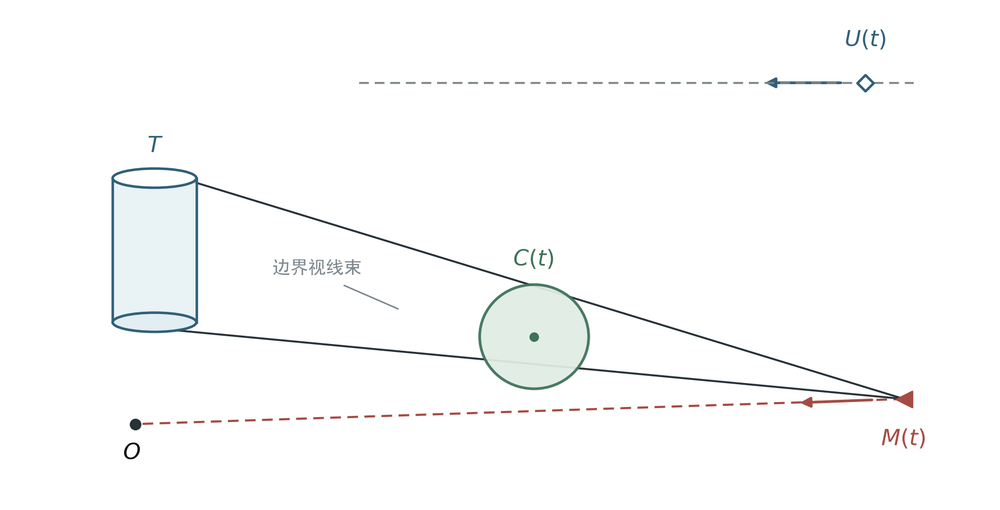
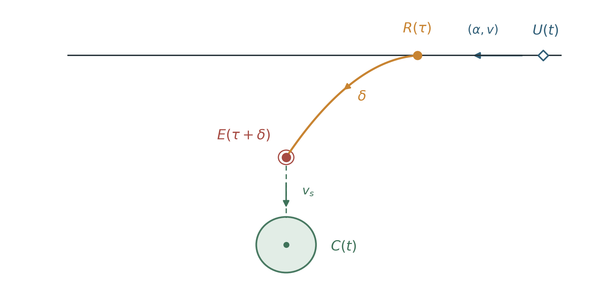
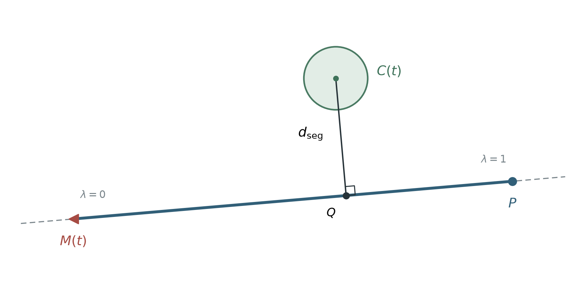
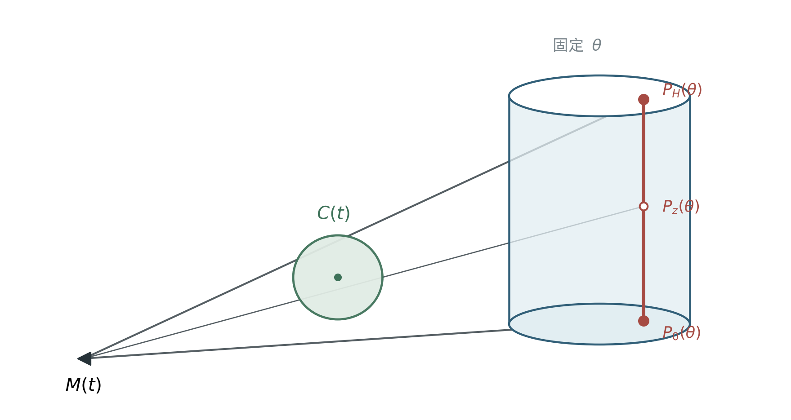
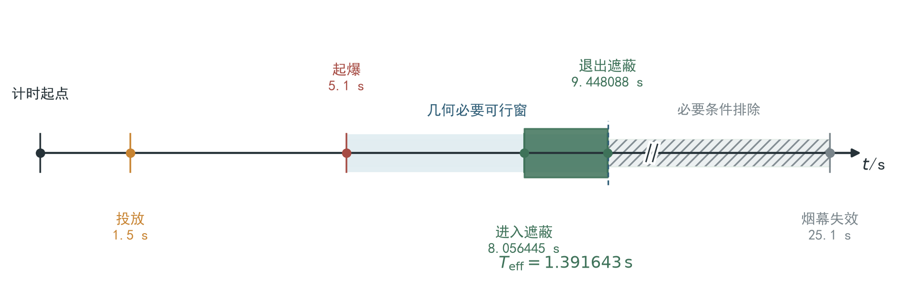
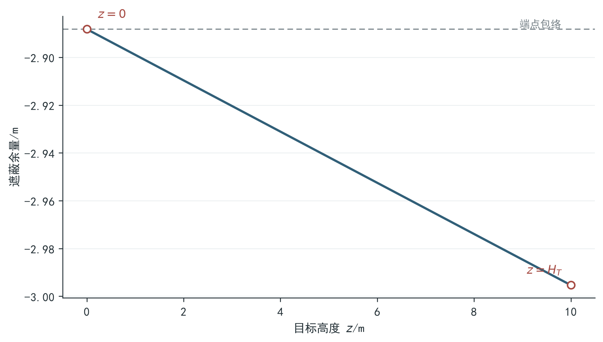

# 问题一：单枚烟幕弹对完整圆柱目标的有效遮蔽时间模型

## 1 问题重述

来袭导弹 M1 从 `(20000,0,2000)` 出发，以 `300 m/s` 的速度飞向位于坐标原点的假目标。
无人机 FY1 从 `(17800,0,1800)` 出发，以 `120 m/s` 朝假目标方向等高度直线飞行，接到任务
`1.5 s` 后投放一枚烟幕弹，烟幕弹再经过 `3.6 s` 起爆。起爆后，烟幕云团中心以
`3 m/s` 的速度竖直下沉；距中心 `10 m` 范围内的烟幕在起爆后 `20 s` 内有效。

需要保护的真目标不是一个点，而是底面圆心为 `(0,200,0)`、半径 `7 m`、高度 `10 m`
的竖直圆柱。问题一要求计算：按照上述固定飞行与投爆方案，烟幕能够把完整圆柱目标从
导弹视线中完全遮住多长时间。

因此，问题的核心并不是优化无人机参数，而是依次解决三个计算问题：确定导弹、烟幕弹和
烟幕云团的位置；判断每一时刻烟幕球是否截断导弹通向完整圆柱所有点的视线；最后求出
这个条件成立的连续时间区间及其总长度。

## 2 问题分析

烟幕起爆前不能产生遮蔽作用，起爆 `20 s` 后也不再计入有效时间，所以只需在有限有效窗
内判断几何关系。运动阶段均由题面给出的匀速直线运动、重力抛体和匀速下沉组成，可以
直接写成解析轨迹，无需使用数值积分。

遮蔽判据必须同时保留“有限视线段”和“完整目标”两个语义。对目标上的任意点 `P`，导弹
真正观察到的是从导弹位置到 `P` 的有向有限线段。烟幕球只有与这条线段相交，才会截断
该点的视线；若烟幕位于导弹后方或目标后方，即使靠近对应的无限直线，也不能算作有效
遮蔽。

另一方面，只检查圆柱中心会漏掉边缘视线。本文以完整圆柱的最坏视线余量作为判据：只有
圆柱上最难遮住的点也落入烟幕球覆盖范围，才认定该时刻发生完整遮蔽。这样，空间遮蔽问题
被转化为“在目标边界上求最大余量”，连续计时问题再被转化为“求最坏余量函数不大于零的
时间集合”。

图 1 将上述两个判据放在同一几何关系中：导弹沿虚线飞向假目标 `O`，但真正需要截断的是
导弹通向圆柱 `T` 边界的实线视线束。



因此，烟幕球 `C(t)` 既要落在导弹与目标之间，又要覆盖整束边界视线；后文分别用有限线段
距离和完整目标最坏余量刻画这两项要求。

本问的航向、速度、投放时刻和引信延迟均由题目给定，因此只需建立“给定控制参数—重构
烟幕状态—计算完整遮蔽区间”的评价过程。

## 3 模型假设

1. 无人机按题面给定的方向和速度等高度匀速直线飞行，投放后不再改变烟幕弹的水平速度。
2. 烟幕弹离机后只受恒定重力作用，不计空气阻力和风；重力加速度取 `9.8 m/s²`。
3. 起爆后的有效烟幕区域为半径 `10 m` 的硬边界球体，球心以 `3 m/s` 匀速竖直下沉，
   球半径在 `20 s` 有效期内保持不变。
4. 真目标为题面给出的完整闭圆柱，完整遮蔽是对圆柱所有点同时成立的几何条件。
5. 起爆后的 `20 s` 均保留为候选有效窗；即使云团中心继续下降，也由实际几何关系决定
   是否遮蔽，不额外设置触地终止条件。
6. 计算采用确定性的双精度浮点数；时间端点由连续函数求根得到，不用命中网格点数量乘以
   步长近似持续时间。

这些假设对应题面的理想化确定性场景。若考虑风、烟幕扩散、浓度衰减或探测概率，需要
重新建立动力学或光学模型，本文结论不能直接外推。

## 4 主要符号说明

| 符号 | 含义 | 单位 |
|---|---|---:|
| `t` | 从题目场景开始计的时间 | s |
| `M_0`、`M(t)` | 导弹初始位置与时刻 `t` 的位置 | m |
| `U_0`、`U(t)` | 无人机初始位置与时刻 `t` 的位置 | m |
| `t_r` | 烟幕弹投放时刻，`t_r=1.5` | s |
| `δ` | 投放至起爆的延迟，`δ=3.6` | s |
| `t_e` | 烟幕弹起爆时刻，`t_e=t_r+δ` | s |
| `R`、`E` | 烟幕弹投放点与起爆点 | m |
| `C(t)` | 起爆后烟幕球心位置 | m |
| `R_s` | 有效烟幕球半径，`R_s=10` | m |
| `v_s` | 烟幕球心下沉速度，`v_s=3` | m/s |
| `R_T`、`H_T` | 真目标圆柱半径与高度，分别为 `7`、`10` | m |
| `P` | 真目标上的任意一点 | m |
| `d_seg` | 烟幕球心到导弹—目标点有限线段的距离 | m |
| `φ_z(θ,t)` | 时刻 `t` 对圆柱边界点的遮蔽余量 | m |
| `Φ(t)` | 完整圆柱的最坏遮蔽余量 | m |
| `I_k` | 第 `k` 个完整遮蔽时间区间 | s |
| `T_eff` | 所有完整遮蔽区间的总长度 | s |

## 5 模型建立

### 5.1 导弹与无人机轨迹

设导弹初始位置为

```text
M_0=(20000,0,2000)，                                                   （1）
```

导弹始终飞向原点，所以其单位飞行方向为 `-M_0/||M_0||`。导弹速度为 `v_M=300 m/s`，
故导弹轨迹为

```text
M(t)=M_0-v_M t M_0/||M_0||。                                          （2）
```

无人机初始位置为 `U_0=(17800,0,1800)`，朝原点的水平单位方向为
`u=(-1,0,0)`，速度为 `v_U=120 m/s`。因此

```text
U(t)=U_0+v_U t u。                                                      （3）
```

式（2）和式（3）把导弹与无人机的位置都写成时间的解析函数，后续几何判定可以直接调用，
避免轨迹积分误差。

### 5.2 烟幕弹与烟幕云团轨迹

烟幕弹在 `t_r=1.5 s` 时投放，投放点为

```text
R=U(t_r)。                                                              （4）
```

离机后，烟幕弹继承无人机水平速度，竖直方向只受重力作用。对
`t∈[t_r,t_e]`，烟幕弹位置为

```text
B(t)=R+v_U(t-t_r)u-(0,0,g(t-t_r)^2/2)。                              （5）
```

其中 `g=9.8 m/s²`，起爆时刻为

```text
t_e=t_r+δ。                                                            （6）
```

把式（6）代入式（5），得到起爆点

```text
E=B(t_e)=U_0+v_U t_e u-(0,0,gδ^2/2)。                                （7）
```

起爆后烟幕球心只做竖直匀速下沉。对 `t∈[t_e,t_e+20]`，有

```text
C(t)=E-(0,0,v_s(t-t_e))。                                              （8）
```

导弹到达假目标前且烟幕仍有效时才需要判断遮蔽，因此计算时间域为

```text
[t_e,t_stop]，
t_stop=min(t_e+20, ||M_0||/v_M)。                                     （9）
```

式（4）至式（8）的状态传递如图 2：航向和速度决定无人机航迹，投放时刻确定 `R`，引信
延迟确定抛体终点 `E`，起爆后再由烟幕球心 `C(t)` 的竖直下沉轨迹进入遮蔽判定。



图中只表示三段运动的先后与方向；各时刻和坐标均由上述解析式计算，不从示意距离读取。

### 5.3 有向有限视线段判据

取真目标上的任意一点 `P`，令

```text
v=P-M(t)。                                                             （10）
```

烟幕球心 `C(t)` 在导弹到 `P` 的无限直线上的投影参数为

```text
λ*=((C(t)-M(t))·v)/(v·v)。                                             （11）
```

真正的视线只对应线段参数 `[0,1]`，所以将投影参数截断为

```text
λ=clip(λ*,0,1)，
Q=M(t)+λv。                                                            （12）
```

式（12）中的 `Q` 是烟幕球心到有限视线段的最近点，距离为

```text
d_seg(C(t),M(t),P)=||C(t)-Q||_2。                                     （13）
```

当且仅当 `d_seg≤R_s` 时，半径为 `R_s` 的烟幕球与导弹到目标点 `P` 的视线段相交。
式（11）至式（13）保留了视线方向：当 `λ*=0` 或 `λ*=1` 外溢时，最近点自动落在导弹端
或目标端，不会把线段外的烟幕误判为有效。

图 3 用粗实线区分真实视线段，用虚线表示两侧延长线。



当 `0<λ*<1` 时，最近点是垂足 `Q`；投影越出区间后，最近点改为 `M(t)` 或 `P`。因此
式（13）衡量的是烟幕对“导弹与目标之间”的截断，而不是对无限直线的接近。

### 5.4 完整圆柱最坏视线模型

真目标底面圆心为 `(0,200,0)`，半径为 `R_T=7 m`，高度为 `H_T=10 m`。将圆柱侧面
的竖直生成线参数化为

```text
P_z(θ)=(R_T cosθ, 200+R_T sinθ, z)，
θ∈[0,2π)，z∈[0,H_T]。                                                 （14）
```

对于给定时刻 `t`，定义目标边界点的遮蔽余量

```text
φ_z(θ,t)=d_seg(C(t),M(t),P_z(θ))-R_s。                               （15）
```

余量为负表示对应视线穿过烟幕球，余量为正表示该点仍未被遮住。为把侧面上的二维搜索
化为圆周上的一维搜索，固定时刻 `t` 和圆周方向 `θ`，考察图 4 中的竖直生成线。



图中 `P_z(θ)` 是生成线上的任意点，`P_0(θ)` 与 `P_H(θ)` 分别是下、上端点。将这三类点
代入式（11）至式（13），并按 `λ*<0`、`0≤λ*≤1` 和 `λ*>1` 检查有限线段投影分支；在
本题有效时段的观察几何下，中间高度不会产生大于两个端点的遮蔽余量。故固定 `θ` 的最坏
余量由上下端点控制，完整圆柱只需在上下圆周上分别求连续极值：

```text
Φ(t)=max_{z∈{0,H_T}} max_{θ∈[0,2π)} φ_z(θ,t)。                       （16）
```

于是，时刻 `t` 发生完整遮蔽当且仅当

```text
t∈[t_e,t_stop] 且 Φ(t)≤0。                                            （17）
```

式（16）使用圆柱上最不利的目标点，而不是圆柱中心。只要 `Φ(t)>0`，就仍有至少一条边缘
视线未被烟幕截断；只有 `Φ(t)≤0`，才能认为完整目标同时被遮住。

### 5.5 连续时间集合与目标量

定义完整遮蔽时间集合

```text
S={t∈[t_e,t_stop] : Φ(t)≤0}。                                         （18）
```

将 `S` 写成互不重叠的闭区间并集

```text
S=I_1∪I_2∪...∪I_K，
I_k=[t_in,k,t_out,k]。                                                 （19）
```

问题一要求的总有效遮蔽时间就是这些区间的总长度：

```text
T_eff=Σ_{k=1}^K (t_out,k-t_in,k)。                                   （20）
```

因此，问题已经由三维运动与遮蔽描述转化为一维连续函数 `Φ(t)` 的符号区间问题。空间层先
计算每个时刻最难遮住的目标点，时间层再寻找 `Φ(t)=0` 的进入和退出边界。

### 5.6 可计算化与主求解逻辑

式（16）含有周期角度上的连续最大值，式（18）又要求得到连续时间区间。为保持完整目标
语义和连续计时精度，采用“两层搜索、两次求精”的确定性算法。

下面先用几何预检缩小可能发生遮蔽的时间范围，再以连续最坏余量和边界求根确定严格区间，
最后通过角向、时间加密复核结果。本问的四项控制已经由题目固定，因而不需要另设参数优化。

对每一个给定时刻 `t`，先在上下圆周各布置 `4096` 个周期角度节点，计算式（15），把
不小于左右相邻节点的位置作为局部最大值候选。随后在每个候选的相邻角区间内对
`-φ_z(θ,t)` 作有界一维最小化，从而把离散候选求精为连续角度极值。上下圆周所有极值
中的最大者即为式（16）的 `Φ(t)`。周期首尾节点相邻处理，避免在 `θ=0` 附近漏掉极值。

得到 `Φ(t)` 的求值器后，先做一个不改变判据的几何预检。若半径为 `r` 的烟幕球与任一
导弹—目标有限线段相交，则球心的每个坐标必定位于该线段坐标范围向外扩张 `r` 的区间内。
而任一目标点都落在圆柱的坐标包围盒中，因此可用导弹解析轨迹、烟幕解析轨迹和该包围盒
直接求出“仍可能相交”的必要时间窗。完整遮蔽比“至少相交一条视线”更强，所以凡是不满足
这个必要条件的时刻必不可能完整遮蔽，可以安全跳过；满足条件的时刻仍必须计算原 `Φ(t)`，
不能据此判为遮蔽。

程序把长度边界向外放宽 `10^-9 m`、把时间右端向外放宽 `2×10^-9 s`，若预检异常则退回
原始有效窗。对本问，`x` 坐标必要条件给出最紧上界，原有效窗 `[5.1,25.1] s` 缩为
`[5.1,9.453583002938] s`。随后才以 `10^-3 s` 为发现步长扫描 `Φ(t)`。相邻时间
节点若发生符号变化，就说明区间中存在 `Φ(t)=0` 的进入根或退出根；对该小区间使用二分
求根，把根的时间括区间压缩至 `10^-9 s`，同时要求根位置满足 `|Φ(t)|≤10^-7 m`。
对于离散局部最小值还需检查无符号变化的相切情况，防止漏掉零测度接触点或窄遮蔽区间。

最后将所有根按时间排序，根据区间内部 `Φ(t)` 的符号组装式（19），合并由于浮点误差
产生的相邻碎片，再按式（20）直接累加区间长度。这个过程给出的时间来自连续边界根，
而不是粗网格计数。

## 6 模型求解

### 6.1 解析运动学结果

将题面参数代入式（3）至式（9），得到

```text
投放点 R=(17620,0,1800) m；
起爆时刻 t_e=5.1 s；
起爆点 E=(17188,0,1736.496) m；
烟幕有效窗 [5.1,25.1] s。                                            （21）
```

导弹到达假目标的时间约为 `66.9992 s`，晚于烟幕有效窗终点，因此式（9）的物理活动域
是 `[5.1,25.1] s`；第 5.6 节的必要条件只在数值执行层进一步缩短昂贵求值区间。

### 6.2 求解步骤

模型求解直接按第 5 节已经建立的计算链执行：

1. 由式（2）和式（8）计算扫描时刻的导弹位置与烟幕球心位置。
2. 对上下圆周使用式（14）生成目标点，再由式（11）至式（13）计算有限视线段距离。
3. 按第 5.6 节的周期角度搜索求出式（16）的连续最坏余量 `Φ(t)`。
4. 先将 `[5.1,25.1] s` 与几何必要窗相交为 `[5.1,9.453583002938] s`，再扫描
   `Φ(t)`，对符号变化区间求解进入根和退出根，并检查相切点。
5. 依据式（18）和式（19）形成完整遮蔽区间，最后按式（20）计算总时长。

主计算采用 `4096` 个角度节点和 `10^-3 s` 的时间发现步长；角度加密至 `8192`、时间
步长减半至 `5×10^-4 s` 只用于检查结果是否稳定，不改变正式模型。

### 6.3 时间边界求解

在整个有效窗内，`Φ(t)≤0` 只形成一个连续区间。进入根和退出根分别为

```text
t_in =8.056445490090 s，
t_out=9.448088158860 s。                                               （22）
```

区间内部最坏余量为负，说明完整圆柱的全部视线均与烟幕球相交；区间外最坏余量为正，
说明至少存在一个未被遮住的圆柱边界点。因此式（22）的两个根分别对应完整遮蔽开始和结束。

## 7 模型结果

表 1 汇总了问题一的正式计算结果。

表 1　FY1 按题定方案投放一枚烟幕弹时的 Q1 结果

| 结果项 | 数值 | 单位 |
|---|---:|---:|
| 投放点 | `(17620,0,1800)` | m |
| 起爆时刻 | `5.100000` | s |
| 起爆点 | `(17188,0,1736.496)` | m |
| 烟幕有效窗 | `[5.1,25.1]` | s |
| 几何必要可行窗 | `[5.1,9.453583002938]` | s |
| 完整遮蔽区间 | `[8.056445490090,9.448088158860]` | s |
| 总有效遮蔽时间 | `1.391642668770` | s |

由式（20）可得

```text
T_eff=9.448088158860-8.056445490090
     =1.391642668770 s。                                               （23）
```

按六位小数报告，问题一的有效遮蔽时间为 `1.391643 s`。这里的两个时间端点均从场景开始
计时；相对于 `5.1 s` 的起爆时刻，烟幕在起爆约 `2.956445 s` 后开始完整遮蔽，并在起爆
约 `4.348088 s` 后结束完整遮蔽。结果只计完整圆柱同时被遮住的时间，没有把部分遮蔽或
仅遮住中心点的时间计入。

为区分“烟幕已经起爆”和“完整圆柱已经被遮住”，图 5 将两段时间放在同一时序上。



浅绿色带是烟幕有效期，浅蓝色带是几何上仍可能遮蔽的必要窗，深色带才是经完整圆柱判据
确认的遮蔽区间；灰色尾段被必要条件直接排除。起爆后需等待最不利边界视线进入烟幕球，
该视线再次离开时完整遮蔽随即结束。

## 8 模型检验与敏感性分析

模型检验围绕运动学、空间判据、连续计时和适用边界进行。这里只列出检验设置、指标与
结论，不另行展开新的数学推导。

表 2　Q1 模型与数值求解检验

| 检验对象 | 设置 | 指标与结果 | 结论 |
|---|---|---|---|
| 解析运动学 | 核对投放点、起爆时刻、起爆点和有效窗 | 坐标误差不超过 `10^-9 m`，时刻误差不超过 `10^-12 s` | 轨迹实现与式（2）至式（9）一致 |
| 角度极值稳定性 | 圆周节点由 `4096` 加密至 `8192` | 关键时刻最大余量差 `1.759×10^-13 m`，小于 `10^-7 m` 门槛 | 完整目标的最坏余量稳定 |
| 时间区间稳定性 | 时间发现步长由 `10^-3 s` 减半至 `5×10^-4 s` | 区间数量不变，端点差和总时长差均为 `0` | 遮蔽区间不依赖当前扫描步长 |
| 根边界精度 | 检查进入根和退出根处的 `|Φ(t)|` | 分别约为 `3.03×10^-10 m`、`3.81×10^-8 m`，均小于 `10^-7 m` | 式（22）的时间边界满足预设精度 |
| 几何剪枝等价性 | 同一参数、同一完整圆柱求值器，仅切换必要窗 | 时长差 `6.13×10^-11 s`，端点最大差 `2.56×10^-10 s` | 剪枝未改变本问连续区间 |
| 几何剪枝效率 | `0.01 s` 配对基准与正式扫描点统计 | 配对扫描点减少 `78.16%`、加速 `1.39×`；正式主/精扫描点由 `20001/40001` 降为 `4355/8709` | 在角向极值仍占主要成本时仍有稳定正收益 |
| 圆柱端点化简 | 在进入、区间中点和退出时刻，对 `361×81` 个侧面点另行采样 | 中间高度超出两端点包络的最大值为 `0 m`，侧面最大余量与上下圆周最大余量相同 | 关键时刻的全侧面检查支持式（16） |

表 2 中的端点化简检查在区间中点的代表性剖面见图 6。



曲线从下端点向上端点单调下降，数值最大值与端点包络重合；进入和退出时刻的全侧面采样
也得到相同结果。该图只补充检验图 4 在本题关键时刻的适用性，不构成另一套求解方法，也
不外推到任意观察几何。

### 8.1 决策变量灵敏度分析

灵敏度分析考察无人机航向、飞行速度、烟幕弹投放时刻和起爆时刻四个控制量。以题定方案
`(180°,120 m/s,1.5 s,5.1 s)` 为基准，每次只改变一个变量，其余变量保持基准值，
且扰动后不重新优化其他变量。其中投放时刻与起爆时刻独立表达，引信延迟随两者之差更新。

表 3　Q1 固定基准方案的单因素决策灵敏度

| 决策变量 | 扫描范围 | 遮蔽时长为正的采样区间 | 不低于基准时长 95% 的采样区间 |
|---|---:|---:|---:|
| 无人机航向角 | `178°–182°` | `179.1°–180.8°` | `179.2°–180.05°` |
| 无人机速度 | `70–140 m/s` | `82–131 m/s` | `83–120 m/s` |
| 投放时刻 | `0–3.0 s` | `1.05–1.65 s` | `1.05–1.50 s` |
| 起爆时刻 | `4.0–6.5 s` | `4.85–5.80 s` | `5.10–5.75 s` |

表 3 已能完整承担四组单因素比较：航向的高保持区间最窄；速度向基准值以上增加时更容易
离开高保持区间；投放和起爆时刻则分别改变弹体的飞行历程、起爆位置与烟幕有效窗。四项
控制量共同决定烟幕何时到达关键视线束，表现出明显的参数耦合。

这些结果是固定其余变量、不重新优化的确定性扫描。表中端点只是当前网格上的首末满足点，
不是连续解析边界、置信区间或成功概率；题面未提供的风场、扩散和浓度变化也不在本分析的
外推范围内。由于这些扰动会偏离 Q1 的固定航迹，表 3 的全部扰动方案均重新检查圆柱侧面
及上下端盖的完整表面；端面圆周降维只用于 Q1 名义方案及其已验证等价的固定观察几何。

## 9 模型评价

本文模型的主要优点是完整保留了题意中的运动、方向和目标边界。轨迹使用解析式，避免了
不必要的积分误差；遮蔽判据使用有向有限视线段，排除了烟幕位于视线延长线时的误判；
空间条件使用完整圆柱最坏余量，避免以目标中心代替整个目标；时间条件通过连续求根得到，
避免固定步长直接计数造成端点偏差。

第 5 节将运动学、烟幕状态、视线距离、目标最坏余量和时间区间依次计算，使题定方案能够
按“状态重构—几何判断—连续计时”的顺序得到可复核结果，也便于进行第 8 节的参数扫描。

模型的局限来自题面理想化假设。烟幕被视为半径固定、边界清晰的球体，未描述浓度随时间
和空间的连续衰减；烟幕中心只做匀速下沉，未考虑风、阻力和地面影响；遮蔽被处理为确定性
几何事件，也没有引入传感器成像、识别概率或作战效果。因此，本文结果适合回答竞赛题设
中的几何有效遮蔽时间，不等同于真实环境中的探测概率或现场效能。

## 10 问题一结论

本文先由解析运动学得到投放点 `(17620,0,1800) m`、起爆时刻 `5.1 s` 和起爆点
`(17188,0,1736.496) m`，再以烟幕球心到导弹—目标点有限视线段的距离建立遮蔽条件，
并用完整圆柱上下边界的连续最坏余量判断是否实现整体遮蔽。最后通过周期角度极值搜索、
连续时间扫描和边界求根得到完整遮蔽时间集合。

计算表明，在 FY1 按题定方案飞行和投放一枚烟幕弹时，完整圆柱目标的有效遮蔽区间为

```text
[8.056445490090, 9.448088158860] s，
```

总有效遮蔽时间为

```text
T_eff=1.391642668770 s≈1.391643 s。
```

该结论回答的是题设确定性理想场景中的完整几何遮蔽时间；当烟幕动力学、有效半径或环境
条件改变时，应重新代入参数并执行同一计算链，而不能直接沿用上述数值。

由此，题定方案的完整遮蔽时长为 `1.391643 s`，其进入、退出时刻均由连续边界求根确定。
