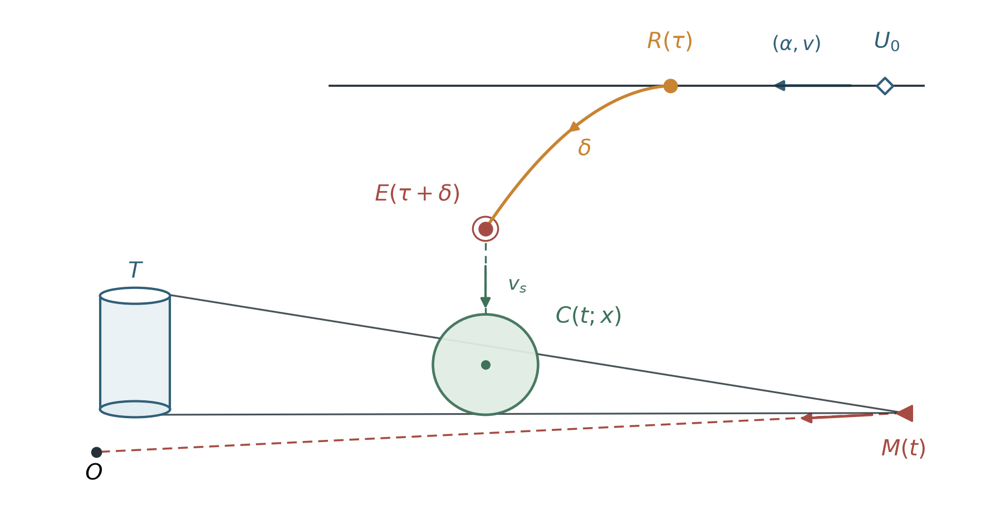
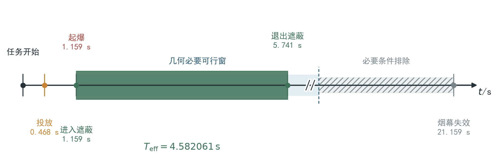

# 问题二：单枚烟幕弹最大有效遮蔽时间的分层优化模型

## 1 问题重述

问题二仍使用无人机 FY1、来袭导弹 M1 和一枚烟幕干扰弹，但不再给定无人机的飞行方向、
速度、投放时刻和引信延迟。需要在题面允许的运动范围内同时确定这四项决策，使烟幕对真
目标的完整有效遮蔽时间尽可能长，并给出相应投放点、起爆点和遮蔽区间。

FY1 初始位置为 `(17800,0,1800) m`。接到任务后，它可以瞬时调整一次航向，随后以
`70–140 m/s` 的速度等高度匀速直线飞行；航向和速度一旦确定便不再改变。烟幕弹离机后
继承无人机的水平速度，并在重力作用下运动。起爆后，半径 `10 m` 的有效烟幕球心以
`3 m/s` 匀速下沉，烟幕有效期为 `20 s`。

M1 从 `(20000,0,2000) m` 出发，以 `300 m/s` 的速度直指坐标原点处的假目标。需要保护
的真目标是底面圆心为 `(0,200,0) m`、半径 `7 m`、高度 `10 m` 的固定圆柱。本文沿用问题
一建立的完整圆柱、有限视线段和连续时间判据，优化的是完整目标被同时遮住的时间，而不
是烟幕中心与某条视线接近的时间。

## 2 问题分析

问题一已经给出了固定航向、速度、投放时刻和引信延迟下的运动方程与完整遮蔽判据。本问
沿用问题一第 5.1—5.5 节的导弹轨迹、烟幕弹抛体运动、云团下沉、有限视线段距离和连续
区间定义，并把上述四个给定量改为待优化变量，由此形成单枚烟幕弹的参数优化问题。

本问的难点不只是“把四个变量送入优化器”。有效遮蔽条件具有明显的几何稀疏性：在大部分
可行域内，烟幕球与导弹—真目标视线相距很远，目标函数直接等于零；只有当起爆位置、起爆
时刻和云团下沉轨迹同时配合时，才能形成正长度遮蔽区间。因此，直接在完整四维域中均匀
随机搜索，容易把计算预算消耗在大片零值平台上。

烟幕云心在某个观察时刻位于导弹与目标中心连线上，可以构造出命中率较高的三维初值流形。
为覆盖完整四维决策域，初值还包括目标方向、导弹方向和全航向守卫，并在原四维变量中继续
连续精修。

据此建立分层优化模型：先用解析可行的中心共线几何和三类航向分域产生初值，再把所有初值
映射回完整四维可行域进行连续精修，最后使用完整圆柱表面连续求值器筛选和精算。

## 3 模型假设

1. FY1 在任务开始时可瞬时改变一次水平航向，随后以固定速度等高度直线飞行，不考虑转弯
   半径、加速度和风的影响。
2. 烟幕弹投放后保留无人机的水平速度，竖直初速度为零，只受恒定重力作用；取
   `g=9.8 m/s²`，不考虑空气阻力和横向漂移。
3. 起爆后的有效区域为半径 `10 m` 的球体，球心以 `3 m/s` 竖直下沉，有效期为 `20 s`；
   有效期内采用清晰的浓度阈值边界。
4. M1 以 `300 m/s` 沿初始位置指向假目标原点的直线匀速飞行，不发生规避或再制导。
5. 真目标为题面给出的完整闭圆柱；只有导弹通向圆柱所有点的有限视线段均被烟幕球截断，
   才认定该时刻发生完整遮蔽。
6. 无人机位置、航向、速度、投放时刻和引信延迟均可精确执行；题面未给出误差分布，因此
   主模型采用确定性优化，执行偏差只在敏感性分析中讨论。

这些假设与题面给出的确定性理想场景一致。若考虑真实风场、云团扩散、导弹机动或控制
误差，需要扩展运动方程并建立随机或鲁棒优化模型，不能直接外推本文数值。

## 4 主要符号说明

| 符号 | 含义 | 取值或单位 |
|---|---|---:|
| `α` | FY1 的水平航向角，从 `x` 轴正向逆时针计 | `[0,2π)`，rad |
| `v` | FY1 的固定飞行速度 | `[70,140]`，m/s |
| `τ` | 从受领任务到投放烟幕弹的时间 | `τ≥0`，s |
| `δ` | 从投放到起爆的引信延迟 | `δ≥0`，s |
| `x=(α,v,τ,δ)` | 问题二的完整决策向量 | 四维向量 |
| `U_0` | FY1 初始位置 | m |
| `u(α)` | 航向 `α` 对应的水平单位向量 | 无量纲 |
| `R(x)`、`E(x)` | 投放点与起爆点 | m |
| `t_e` | 烟幕弹起爆时刻 | s |
| `C(t;x)` | 决策 `x` 下时刻 `t` 的烟幕球心 | m |
| `M(t)` | 时刻 `t` 的导弹位置 | m |
| `P` | 真目标圆柱上的任意一点 | m |
| `Φ(t;x)` | 完整圆柱在时刻 `t` 的最坏遮蔽余量 | m |
| `S(x)` | 决策 `x` 对应的完整遮蔽时间集合 | s |
| `J(x)` | 完整遮蔽集合的总长度 | s |
| `t_o` | 构造几何种子时选取的观察时刻 | s |
| `s` | 观察时刻的烟幕龄，即 `s=t_o-t_e` | s |
| `q` | 导弹—目标中心线段上的比例参数 | `[0,1]` |
| `z` | 完整四维可行域的归一化坐标 | `[0,1]^4` |

## 5 模型建立

### 5.1 决策变量与运动学

将问题一的固定控制参数一般化后，问题二的完整独立决策为

```text
x=(α,v,τ,δ)，
0≤α<2π，70≤v≤140，τ≥0，δ≥0。                                      （1）
```

航向 `α` 对应的水平单位向量为

```text
u(α)=(cosα,sinα,0)。                                                  （2）
```

导弹初始位置为 `M_0=(20000,0,2000)`，并以 `v_M=300 m/s` 沿指向原点的方向飞行，
故其轨迹为 `M(t)=M_0-v_M t M_0/||M_0||`。这一轨迹与决策 `x` 无关，但会随时间改变烟幕
需要截断的视线位置。

FY1 初始位置记为 `U_0=(17800,0,1800)`。由等高度匀速运动可得投放点

```text
R(x)=U_0+vτu(α)。                                                     （3）
```

烟幕弹在投放后继续保持水平速度，经过 `δ` 秒起爆，因此起爆时刻和起爆点为

```text
t_e=τ+δ，                                                            （4）
E(x)=U_0+vt_eu(α)-(0,0,gδ²/2)。                                     （5）
```

起爆后烟幕球心只做竖直匀速下沉。在烟幕有效窗内有

```text
C(t;x)=E(x)-(0,0,v_s(t-t_e))，
t∈[t_e,min(t_e+20,t_M)]，                                            （6）
```

其中 `v_s=3 m/s`，导弹到达假目标的时刻为

```text
t_M=||M_0||/v_M。                                                     （7）
```

式（3）至式（6）的决策传递与最终遮蔽对象见图 1。



航向角和速度先确定 FY1 航迹，投放时刻确定 `R`，引信延迟再确定 `E`；由此得到的烟幕
球心 `C(t;x)` 最终接受完整真目标边界视线束的统一检验。图中的距离仅作关系示意。

### 5.2 完整圆柱有限视线段目标函数

对真目标圆柱上的任意点 `P`，导弹到该点的有限视线段可参数化为

```text
L(λ;t,P)=M(t)+λ(P-M(t))，0≤λ≤1。                                    （8）
```

烟幕球心到这条有限线段的距离记为

```text
d_seg(C(t;x),M(t),P)
=min_{0≤λ≤1} ||C(t;x)-L(λ;t,P)||_2。                                （9）
```

式（9）保留了导弹到目标的视线方向，烟幕位于导弹后方或目标后方时不会因接近无限直线
而被误判为遮蔽。定义完整圆柱最坏遮蔽余量

```text
Φ(t;x)=max_{P∈T} d_seg(C(t;x),M(t),P)-R_s，                         （10）
```

其中 `T` 是半径 `7 m`、高度 `10 m` 的真目标圆柱，`R_s=10 m` 为烟幕有效半径。问题一
在固定观察几何下采用上下端面圆周降维；本问的航迹随决策改变，因此式（10）在圆柱侧面及
上下端盖的完整表面网格上求最大值，并按角向、竖向和时间三重加密验证稳定性。
时刻 `t` 发生完整遮蔽当且仅当 `Φ(t;x)≤0`。

定义决策 `x` 的完整遮蔽集合

```text
S(x)={t∈[t_e,min(t_e+20,t_M)] : Φ(t;x)≤0}。                         （11）
```

若 `S(x)` 由若干互不重叠的闭区间 `[a_k,b_k]` 构成，则总有效遮蔽时间为

```text
J(x)=μ(S(x))=Σ_k(b_k-a_k)。                                         （12）
```

式（12）直接累加连续遮蔽区间长度，允许多个不连续区间存在，不用离散时刻命中数乘以步长
代替持续时间。

### 5.3 约束条件与完整优化模型

起爆点不得低于地面，起爆必须发生在导弹到达假目标之前，因此硬约束为

```text
E_z(x)≥0，t_e≤t_M。                                                   （13）
```

结合式（1）、式（12）和式（13），问题二的正式优化模型为

```text
max    J(x)
s.t.   x=(α,v,τ,δ)，
       0≤α<2π，70≤v≤140，τ≥0，δ≥0，
       E_z(x)≥0，τ+δ≤t_M。                                           （14）
```

式（14）是几何播种和分层算法共同求解的原问题，最终方案按式（12）的完整圆柱连续时长排序。

### 5.4 完整四维可行域坐标

直接在式（14）中处理多个相互关联的时间约束不利于连续优化。令 FY1 初始高度为 `H=1800 m`，
烟幕弹在地面起爆对应的最大引信延迟为

```text
δ_max=sqrt(2H/g)。                                                    （15）
```

引入归一化变量 `z=(z_α,z_v,z_δ,z_t)∈[0,1]^4`，并作映射

```text
α=2πz_α，
v=70+70z_v，
δ=δ_max z_δ，
t_e=δ+z_t(t_M-δ)，
τ=t_e-δ。                                                            （16）
```

式（16）自动保证速度范围、非负投放时刻、非负引信延迟、非负起爆高度和起爆时刻上界。
反过来，式（14）的任意可行决策都能映射到某个 `z∈[0,1]^4`，所以它没有缩小原问题的
可行域。正式连续精修在这个完整四维坐标中进行。

### 5.5 中心共线几何播种

为避免四维搜索长期停留在零值平台，先构造容易形成遮蔽的几何初值。记真目标圆柱中心为

```text
P_c=(0,200,5)。                                                       （17）
```

选取观察时刻 `t_o`、该时刻的烟幕龄 `s` 和线段比例 `q`，令观察时刻的烟幕云心位于导弹
与目标中心的连线上：

```text
G(t_o,q)=M(t_o)+q(P_c-M(t_o))，0≤q≤1。                              （18）
```

由于云团从起爆后已下沉 `v_s s`，相应起爆时刻和起爆点为

```text
t_e=t_o-s，
E(t_o,s,q)=G(t_o,q)+(0,0,v_s s)。                                   （19）
```

给定式（19）的起爆状态，可唯一反解原决策：

```text
δ=sqrt(2(H-E_z)/g)，
τ=t_e-δ，
v=||E_h-U_h||/t_e，
α=atan2(E_y-U_y,E_x-U_x)。                                          （20）
```

为保证式（20）可行，`q` 必须同时满足

```text
0≤q≤1，
max(0,H-gt_e²/2)≤E_z(q)≤H，
70t_e≤||E_h(q)-U_h||≤140t_e。                                      （21）
```

式（19）中的起爆高度关于 `q` 为一次函数，水平距离平方关于 `q` 为二次函数。因此，给定
`(t_o,s)` 后，可以直接解一次与二次不等式，得到全部可行 `q` 区间；其结果至多是两个
闭区间的并。算法只在这些解析可行区间内抽取 `q`，不再先随机猜测再大量拒绝。

需要强调的是，式（18）至式（21）只定义高命中率的中心共线种子流形。它少一个自由度，
不能替代式（14）的完整四维模型。所有几何种子随后都要进入式（16）的四维域继续优化。

### 5.6 物理分域与全航向守卫

为检查中心共线种子之外的区域，模型同时在原变量域生成三类覆盖初值：

1. `45%` 的航向位于 FY1 指向真目标中心方向的 `±0.18 rad` 邻域；
2. `45%` 的航向位于 FY1 指向 M1 初始位置方向的 `±0.18 rad` 邻域；
3. `10%` 的航向在 `[0,2π)` 全域取值，作为分域外守卫。

三类初值的速度和两个时间变量都通过式（16）生成，因此天然满足硬约束。前两类利用任务
几何提高正值命中率，第三类则保留发现分域外更优方案的机会。没有发现守卫反例只能说明
当前计算预算下未发现反例，不能被解释为两个局部航向带已经严格覆盖全域。

### 5.7 分层优化求解模型

根据式（10）至式（21），采用“几何播种—完整域精修—连续筛选—统一精算”的四层算法。
前两层共同生成并改善物理可达候选，其中代理函数只能提出移动方向；第二层的正式时长接受
规则和第三层连续筛选共同守住严格评价口径；第四层完成高精度复算。

第一层是初值生成、几何必要窗与连续引导代理。对任一候选 `x`，烟幕球若与某条
导弹—目标有限线段相交，则球心每一坐标必须落在线段坐标范围向外扩张烟幕半径后的区间；
用完整圆柱包围盒代替具体目标点后得到的仍是必要条件。将这些解析坐标条件与烟幕活动窗
求交，得到候选自己的必要可行窗 `W_geo(x)`。窗外一定不能完整遮蔽，窗内仍必须计算完整
圆柱最坏余量，故这一步不是新的物理假设，也不是充分判据。

程序把长度边界向外扩张 `10^-9 m`、时间右端向外扩张 `2×10^-9 s`，预检异常时退回原
活动窗。在 `W_geo(x)` 内取 `41` 个时刻，并在圆柱
上下圆周各取 `64` 个角点，得到离散最坏余量 `m_k`。定义平滑代理

```text
G(x)=Δt Σ_{k=1}^{41} sigmoid(-m_k/2)。                              （22）
```

`G(x)` 只用于给初值排序和引导局部搜索。必要窗缩短后，`41` 点在可能区域内更密，
因此代理数值与旧实现不要求相同；它越大，只表示当前候选在可能区域内更接近遮蔽，
不是正式遮蔽时长。所有候选仍由后两层的原连续目标决定去留。

第二层把每个入选初值映射为式（16）的 `z∈[0,1]^4`，使用有界 Powell 无导数法最大化
式（22）。每个起点保留精修前后两个方案，并分别按式（12）计算连续遮蔽时长；只有精修后
的正式时长更优时才接受，否则回到精修前方案。这个比较保证代理误差不会降低正式结果。

第三层使用统一的完整圆柱连续筛选器。对每个候选先以

```text
时间发现步长 0.02 s，角向节点数 128，竖向/径向层数 17               （23）
```

求解 `Φ(t;x)=0` 的进入与退出边界，形成式（11）的连续区间，再按式（12）计算筛选时长。

第四层按筛选时长、代理值和固定候选序号排序，取前三名，以

```text
时间发现步长 0.005 s，角向节点数 512，竖向/径向层数 33              （24）
```

统一精算。最终结果取三名中式（12）最大的方案，同时保留其他候选用于判断近优结构。

正式计算共使用由 `3` 个固定种子产生的 `6` 个中心共线初值、`1` 个严格可行几何锚点以及
`8` 个物理分域与全域守卫初值，共 `15` 个多启动入口。该流程完整保留式（14）的目标和
可行域，但由于计算预算有限，结论表述为稳定可行近优解，而不是严格全局最优解。

## 6 模型求解

### 6.1 初值生成与完整域搜索

模型求解直接执行第 5.7 节建立的分层算法。中心共线入口先由式（18）和式（19）构造起爆
状态，再通过式（20）反解决策，并用式（21）复核可行性；物理分域入口则直接由式（16）
产生。三个固定随机种子为

```text
250827，250828，250829。                                             （25）
```

每个种子的中心共线生成器和物理分域生成器各形成 `128` 个可行候选。经式（22）排序后，
中心共线部分每个种子保留 `2` 个起点；物理分域汇总保留目标方向 `2` 个、导弹方向 `2` 个、
全域守卫 `4` 个，再加入严格可行几何锚点，构成 `15` 个正式入口。

随后，每个入口均按式（16）进入完整四维有界 Powell 搜索。优化器的单起点上限为
`80` 次迭代和 `240` 次代理求值，变量与函数收敛阈值分别为 `10^-5` 和 `10^-7`。连续
筛选和最终精算均按式（23）、式（24）调用同一个完整圆柱求值器，不因候选来源不同而
改变评价标准。

### 6.2 多启动筛选结果

在 `15` 个多启动入口中，有 `10` 个候选得到正长度完整遮蔽区间。按式（23）的筛选时长
排序后，前三个候选均来自中心共线初值，但它们已经进入完整四维坐标接受统一搜索与评价。
前三名精算时长分别为

```text
4.582060996982 s，
4.572939890998 s，
4.536700765007 s。                                                    （26）
```

式（26）说明最优候选并非由显示精度上的并列产生。全域守卫在本次固定预算下没有发现超过
第一名的分域外候选，但这仍只是计算覆盖诊断，不构成全局最优证明。

### 6.3 最佳决策的运动学结果

将最佳候选的四项决策代入式（2）至式（6），得到

```text
α*=0.107007114502 rad，
v*=91.587028740138 m/s，
τ*=0.468356067067 s，
δ*=0.690939155376 s。                                                （27）
```

航向角约为 `6.131°`，表示 FY1 沿 `x` 轴正方向偏向 `y` 轴正方向飞行。相应投放点、起爆
时刻和起爆点为

```text
R*=(17842.649987795,4.581351781,1800) m，
t_e*=1.159295222443 s，
E*=(17905.569097028,11.339960354,1797.660755109) m。               （28）
```

起爆点高度为正，速度位于题面范围内，投放时刻、引信延迟也均为正，因此式（13）的全部
硬约束都满足。

### 6.4 连续遮蔽区间

对式（27）的最佳决策，按式（24）计算完整圆柱最坏余量。`Φ(t;x*)≤0` 形成一个连续区间：

```text
[1.159295222443,5.741356219425] s。                                 （29）
```

两个端点均从任务开始时刻计时。新方案在 `t_e*=1.159295222443 s` 起爆瞬间就满足完整
遮蔽，因此左端点是烟幕活动域边界而不是 `Φ(t;x*)=0` 的方程根；退出根发生在起爆后约
`4.582061 s`。区间内部完整圆柱所有视线都与烟幕球相交，区间外至少有一个圆柱边界点
未被遮住。

为直观看出起爆、进入遮蔽和退出遮蔽之间的时间关系，将式（27）至式（29）的关键时刻列于
图 2。



浅色带表示烟幕有效期，深色带表示完整遮蔽区间；双斜线只压缩无关键事件的后段时间，不
改变各标注时刻的精算值。

## 7 模型结果

表 1 汇总问题二的正式投放策略。

表 1　FY1 投放一枚烟幕弹干扰 M1 的优化结果

| 结果项 | 数值 | 单位 |
|---|---:|---:|
| 航向角 | `0.107007114502`（约 `6.131°`） | rad（°） |
| 无人机速度 | `91.587028740138` | m/s |
| 投放时刻 | `0.468356067067` | s |
| 引信延迟 | `0.690939155376` | s |
| 投放点 | `(17842.649987795,4.581351781,1800)` | m |
| 起爆时刻 | `1.159295222443` | s |
| 起爆点 | `(17905.569097028,11.339960354,1797.660755109)` | m |
| 几何必要可行窗 | `[1.159295222443,7.049756278040]` | s |
| 完整遮蔽区间 | `[1.159295222443,5.741356219425]` | s |
| 总有效遮蔽时间 | `4.582060996982` | s |

由式（12）可得

```text
J(x*)=5.741356219425-1.159295222443
     =4.582060996982 s。                                             （30）
```

按六位小数报告，在给定多启动规模和精修预算下得到的最佳有效遮蔽时间为 `4.582061 s`。
该方案满足全部硬约束，并在数值加密和局部扰动检验中保持稳定。

## 8 模型检验与敏感性分析

模型检验只围绕实现一致性、数值稳定性、结构规律和现实适用性展开。用于开发阶段的完整
误差路径、独立求解细节和压力网格不在讲解稿中展开。

表 2　Q2 模型与结果的精炼检验

| 检验对象 | 设置 | 指标与结果 | 结论 |
|---|---|---|---|
| 运动学与硬约束 | 将式（27）回代式（3）至式（6），复核式（13） | 投放点和起爆点回代残差均为 `0`；所有硬约束余量为正 | 正式方案可行，运动学实现一致 |
| 向问题一退化 | 固定 `x=(π,120,1.5,3.6)`，即采用问题一的航向、速度、投放时刻和引信延迟 | 本问评价器得到 `1.391642818 s`，问题一为 `1.391642669 s`，差 `1.49×10^-7 s` | 四个变量固定后，本问在数值精度内退化为问题一 |
| 连续求值稳定性 | 时间步长连续减半、角度节点连续加倍 | 最细层时长/端点差约 `1.73×10^-7 s`；真实退出根残差小于 `10^-6 m` | 式（29）在原阈值内稳定 |
| 完整目标必要性 | 将完整圆柱错误退化为目标中心点作对照 | 中心点模型会把时长高估约 `0.041209 s` | 不能用中心点替代式（10）的完整圆柱 |
| 结构规律 | 改变烟幕半径、有效期及目标尺寸 | 烟幕半径和有效期增大时遮蔽时长不减；目标半径和高度增大时遮蔽时长不增 | 模型响应方向与几何机制一致 |
| 执行偏差 | 航向 `±0.25°`、速度 `±1 m/s`、两个时间变量 `±0.02 s` | 四类小扰动最小保留率依次为 `98.23%`、`99.07%`、`98.31%`、`97.83%` | 名义方案不是孤立数值尖峰 |
| 几何剪枝等价性 | 同一旧/新正式候选仅切换必要窗 | SCREEN 时长差不超过 `1.71×10^-10 s`，端点差同量级 | 正式连续目标未被剪枝改变 |
| 几何剪枝效率 | 配对 SCREEN 与端到端正式运行 | 扫描点减少 `70.43%`，SCREEN 加速 `3.00–3.19×`；正式运行 `180.60→79.55 s` | 有明确正收益 |

以式（27）的正式方案为基准，分别施加航向 `±0.25°`、速度 `±1 m/s`、投放时刻
`±0.02 s` 和引信延迟 `±0.02 s` 的小扰动，其余决策保持不变且不重新优化，得到表 3。
这些扰动是诊断压力带，不是概率置信区间。

表 3　Q2 决策变量的小扰动保持性

| 变化因素 | 小扰动带 | 最小保留率 | 结论 |
|---|---:|---:|---|
| 飞机航向 | `±0.25°` | `98.234%` | 两侧均保持有效遮蔽，正向偏差较敏感 |
| 飞行速度 | `±1 m/s` | `99.075%` | 基准附近较平缓 |
| 投放时刻 | `±0.02 s` | `98.313%` | 推迟投放侧下降更快 |
| 引信延迟 | `±0.02 s` | `97.827%` | 延长引信侧最敏感 |

## 9 模型评价

本文模型的主要优点是同时保留了题意完整性与计算可行性。首先，正式目标直接建立在完整
圆柱和有限视线段上，避免把目标简化为中心点或把有向线段替换为无限直线。其次，式（16）
把全部硬约束嵌入完整四维坐标，连续优化不会频繁产生不可行点。再次，式（18）至式（21）
利用遮蔽几何生成解析可行初值，提高穿越零值平台的效率；但这些初值随后仍进入完整四维域，
没有把一个三维种子流形误当成完整模型。最后，物理分域和全航向守卫保留了发现种子流形
之外候选的机会，所有候选又由同一连续目标统一评价。

模型的第一项局限是没有严格全局最优性证书。完整四维域虽然被保留，但正式搜索仍采用固定
数量的多启动入口和有限局部优化预算；全域守卫未发现更优反例，不等于数学上排除了所有
反例。第二项局限来自题面理想化：模型没有考虑风、空气阻力、烟幕扩散和渐变浓度，也没有
考虑导弹机动、传感器识别概率和无人机控制误差。第三项局限是代理函数只用于搜索引导，
它与正式遮蔽时长并不完全等价，因此最终结果必须始终由式（10）至式（12）重新评价。

## 10 问题二结论

本文以无人机航向、速度、投放时刻和引信延迟组成完整四维决策，利用烟幕弹运动学与完整
圆柱有限视线段最坏余量建立式（14）的连续优化模型。为解决目标函数零值平台较大的问题，
模型先由中心共线几何解析生成可行初值，同时设置目标方向、导弹方向和全航向守卫，再把
全部候选送入完整四维域精修，并使用同一连续遮蔽目标筛选和精算。

正式方案为

```text
α*=0.107007114502 rad，v*=91.587028740138 m/s，
τ*=0.468356067067 s，δ*=0.690939155376 s。                          （31）
```

对应投放点和起爆点分别为

```text
R*=(17842.649987795,4.581351781,1800) m，
E*=(17905.569097028,11.339960354,1797.660755109) m。                 （32）
```

完整圆柱目标的有效遮蔽区间为

```text
[1.159295222443,5.741356219425] s，                                 （33）
```

总有效遮蔽时间为

```text
J(x*)=4.582060996982 s≈4.582061 s。                                 （34）
```

该结果满足题面全部运动与时间约束，并在数值加密、结构规律和局部扰动检查中保持稳定。结论
适用于题面给定的确定性理想场景，应表述为完整四维模型在固定计算预算下得到的稳定可行
近优解，而不应扩张为严格全局最优或真实作战环境中的确定效能。
