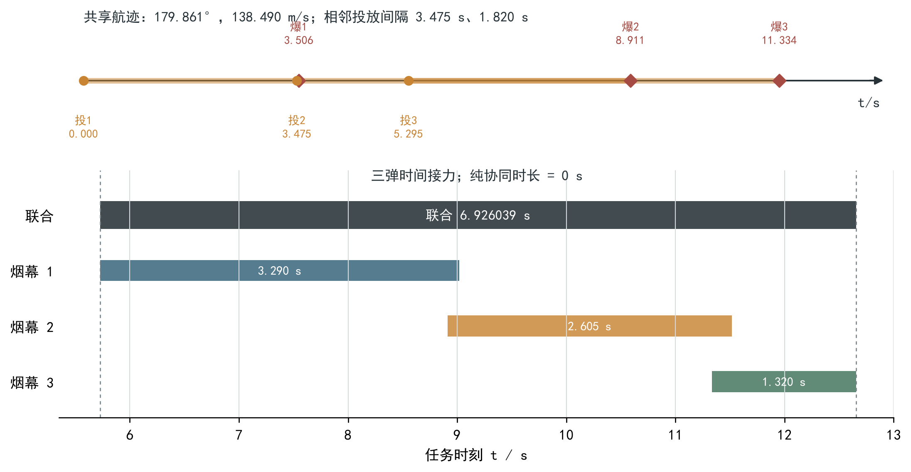

# 问题三：同一无人机三枚烟幕弹的联合投放优化模型

## 1 问题重述

无人机 FY1 接到任务后立即选择一个水平飞行方向，并以 `70～140 m/s` 的速度做匀速直线
飞行。FY1 最多投放三枚烟幕弹，相邻两次投放的时间间隔不得小于 `1 s`。每枚烟幕弹离机
后做平抛运动，在设定延迟后起爆；烟幕形成半径为 `10 m` 的球形云团，起爆后以 `3 m/s`
的速度匀速下沉，并在起爆后的 `20 s` 内有效。

需要确定 FY1 的共同航向、共同速度以及三枚烟幕弹各自的投放时刻和起爆延迟，使三枚烟幕
弹对来袭导弹 M1 的联合有效遮蔽时间最长，并给出可执行的投放、起爆位置与时序方案。

这里的“联合遮蔽”按集合并集计时：某一时刻只要当前仍有效的烟团能够共同遮住真实圆柱
目标的全部可见表面，该时刻就计入有效遮蔽时间。

## 2 问题分析

本问沿用问题二第 5.1—5.3 节的单弹运动方程、完整圆柱有限视线段判据和连续时间目标。
将单弹的投放时刻与起爆延迟分别增加下标 `k=1,2,3`，并令三枚弹共享同一航向和速度，
即可得到八个连续决策变量；相邻投放时刻再满足至少 `1 s` 的间隔约束。

如果直接在八维区间中随机搜索，绝大多数起爆点都会远离“导弹—目标”视线，严格遮蔽时长
为零，计算预算主要浪费在没有物理意义的区域。此外，三枚烟幕弹共享航向和速度，投放时刻
相互耦合，需要同时优化三个事件的时间关系。

为此，将求解分成两层：外层搜索 FY1 的共享航迹；
对每条航迹，利用导弹视线、烟团下沉和弹体自由落体方程，反推出“在某观察时刻能够把烟团
送至中心视线附近”的可行服务事件。这样，每条航迹下的三个投爆事件不再盲目生成，而是从
一条由数学物理关系确定的服务事件曲线上选取。最后，再返回原始八个变量，用完整圆柱判据
进行联合精修。

中心视线关系用于生成高质量候选，最终时长由完整圆柱、有限视线段和连续时间边界共同判定。

## 3 模型假设

在题目条件基础上作如下假设：

1. 无人机接到任务后立即改变至给定航向，此后保持等高度、等速度直线飞行；
2. 烟幕弹离机瞬间继承无人机的水平速度，忽略空气阻力，竖直方向仅受重力作用；
3. 烟幕起爆后立即形成半径为 `10 m` 的球形有效烟团，球心以 `3 m/s` 匀速下沉，有效期为
   `20 s`；
4. 导弹 M1 按题目给定的方向和速度做匀速直线运动；
5. 真实目标按半径 `7 m`、高 `10 m` 的竖直圆柱处理，只评价导弹视点可见的圆柱表面；
6. 当从导弹到任一可见目标点的有限线段与至少一个有效烟团相交时，该目标点被遮蔽；所有
   可见目标点均被遮蔽时，才认定该时刻形成有效遮蔽；
7. 三枚烟幕弹按投放时刻先后编号，相邻投放时刻之差不小于 `1 s`，三枚弹共享同一无人机
   航向和速度；
8. 不额外考虑风场、烟团扩散、浓度衰减、无人机转弯过程及控制误差。

## 4 主要符号说明

| 符号 | 含义 | 单位 |
|---|---|---:|
| `U_0` | FY1 初始位置向量 | m |
| `M_0` | M1 初始位置向量 | m |
| `v_M` | M1 速度向量 | m/s |
| `θ` | FY1 水平航向角 | rad |
| `v` | FY1 飞行速度 | m/s |
| `h(θ)` | FY1 水平航向单位向量 | — |
| `τ_k` | 第 `k` 枚烟幕弹投放时刻 | s |
| `δ_k` | 第 `k` 枚烟幕弹起爆延迟 | s |
| `t_k^e` | 第 `k` 枚烟幕弹起爆时刻 | s |
| `R_k`、`E_k` | 第 `k` 枚烟幕弹投放点、起爆点 | m |
| `C_k(t)` | 第 `k` 个烟团在时刻 `t` 的球心 | m |
| `R_s` | 烟团半径，`R_s=10` | m |
| `V(t)` | 时刻 `t` 从 M1 观察到的圆柱可见表面点集 | — |
| `A(t)` | 时刻 `t` 仍在有效期内的烟团编号集 | — |
| `d_seg(C,M,P)` | 点 `C` 到有限线段 `MP` 的距离 | m |
| `Φ_3(t;x)` | 三烟团联合完整遮蔽余量 | m |
| `J_3(x)` | 三烟团联合有效遮蔽总时长 | s |

## 5 模型建立

### 5.1 共享航迹与三枚烟幕弹运动模型

令 FY1 的水平航向单位向量为

```text
h(θ)=(cosθ,sinθ,0)。                                           (1)
```

FY1 在时刻 `t` 的位置为

```text
U(t)=U_0+v t h(θ)。                                            (2)
```

第 `k` 枚烟幕弹在 `τ_k` 时刻投放，故投放点为

```text
R_k=U_0+v τ_k h(θ)。                                          (3)
```

其起爆时刻满足

```text
t_k^e=τ_k+δ_k，                                                (4)
```

起爆点为

```text
E_k=U_0+v t_k^e h(θ)-(0,0,gδ_k²/2)。                          (5)
```

起爆后烟团只做竖直下沉，因此在有效期内

```text
C_k(t)=E_k-(0,0,3(t-t_k^e))，
t_k^e≤t≤t_k^e+20。                                            (6)
```

M1 的位置为

```text
M(t)=M_0+v_M t。                                               (7)
```

于是问题三的决策向量写成

```text
x=(θ,v,τ_1,τ_2,τ_3,δ_1,δ_2,δ_3)。                            (8)
```

### 5.2 多烟团联合完整遮蔽判据

对任意可见目标点 `P∈V(t)`，计算每个有效烟团球心到有限视线段 `M(t)P` 的距离。点到线段的
距离为

```text
d_seg(C,M,P)=||C-[M+λ*(P-M)]||，
λ*=min{1,max{0,((C-M)·(P-M))/||P-M||²}}。                    (9)
```

这里必须使用有限线段而非无限直线，以避免把位于导弹后方或目标后方的烟团误判为有效。

时刻 `t` 的有效烟团集合为

```text
A(t)={k:t_k^e≤t≤t_k^e+20}。                                  (10)
```

对一个目标点，只要存在一个有效烟团遮住它即可；对完整圆柱，则要求所有可见目标点均被某个
有效烟团遮住。因此联合遮蔽余量定义为

```text
Φ_3(t;x)=max_{P∈V(t)} min_{k∈A(t)}
          [d_seg(C_k(t),M(t),P)-R_s]。                        (11)
```

当 `A(t)` 为空时令 `Φ_3(t;x)=+∞`。由式（11），

```text
Φ_3(t;x)≤0  ⇔  时刻 t 的全部可见圆柱表面均被联合遮蔽。       (12)
```

式（11）中的量词顺序为“先对每个目标点选最有利烟团，再找最难遮住的目标点”，因而允许不同
烟团遮住圆柱的不同部分，同时也自然包含单个烟团独立完成完整遮蔽的情形。

当某时刻只有第 `k` 个烟团有效时，`A(t)={k}`，式（11）中的内层最小值消失，联合余量
退化为单烟团最坏遮蔽余量。因此，多烟团判据的联合结构在单烟团情形下退化为问题二形式。

### 5.3 连续时间目标与约束

定义联合有效遮蔽时间集合

```text
I_3(x)={t:Φ_3(t;x)≤0}，                                      (13)
```

则目标函数为其勒贝格测度，即各连续遮蔽区间并集的总长度：

```text
max J_3(x)=μ(I_3(x))。                                       (14)
```

决策变量满足

```text
0≤θ<2π， 70≤v≤140，                                           (15)
τ_1≥0， τ_2-τ_1≥1， τ_3-τ_2≥1，                              (16)
δ_k≥0， E_{k,z}≥0， t_k^e≤t_M， k=1,2,3，                    (17)
```

其中 `t_M` 为 M1 到达目标附近的截止时刻。式（16）把题目的投放间隔直接作为硬约束；目标
函数按时间并集计量，所以多个烟团同时遮蔽同一时段不会被重复计时。

### 5.4 固定航迹下的物理服务事件曲线

直接在八维空间搜索会产生大量零值点。为缩小候选域，固定共享航迹 `(θ,v)`，再选择希望烟团
发挥作用的观察时刻 `t`。记圆柱几何中心为 `P_c`，令候选烟团球心落在 M1 至 `P_c` 的中心
视线附近。其水平分量满足

```text
U_{0,xy}+v t^e h_{xy}(θ)
=M_{xy}(t)+q[P_{c,xy}-M_{xy}(t)]。                            (18)
```

式（18）是关于起爆时刻 `t^e` 和视线比例 `q` 的二元一次方程；当两条水平方向不平行时可
直接求解。令对应视线点为

```text
G(t,q)=M(t)+q[P_c-M(t)]，                                    (19)
```

烟团在观察时刻的年龄为

```text
a=t-t^e。                                                     (20)
```

由于烟团已自然下沉 `3a`，它的起爆高度应满足

```text
E_z=G_z(t,q)+3a。                                             (21)
```

再由平抛运动的竖直分量反解起爆延迟和投放时刻：

```text
δ=sqrt[2(U_{0,z}-E_z)/g]， τ=t^e-δ。                          (22)
```

仅保留满足

```text
0<q<1， 0≤a≤20， 0≤E_z≤U_{0,z}， τ≥0                         (23)
```

并能回代通过全部硬约束的事件。当 `t` 在可行观察时窗内连续变化时，便得到固定航迹下的一维
服务事件曲线 `(τ(t),δ(t))`。

中心视线用于把烟团送到高概率有效区域，严格评价仍采用式（11）的完整圆柱判据。航迹候选
同时包含问题二优质航迹、已有可行航迹、解析锚点邻域以及少量全航向守卫，从而覆盖事件
曲线邻域和分域外区域。

### 5.5 三事件调度与可行参数化

对每条共享航迹，从服务事件曲线上选择三个事件，并按投放时刻排序：

```text
τ_1≤τ_2≤τ_3。                                                 (24)
```

只有满足式（16）的组合才进入严格评价。为使连续精修始终满足投放间隔，可把单位变量
`z_1,z_2,z_3∈[0,1]` 映射为

```text
τ_1=(t_M-2)z_1，
τ_2=τ_1+1+(t_M-τ_1-2)z_2，
τ_3=τ_2+1+(t_M-τ_2-1)z_3。                                   (25)
```

起爆延迟的自由落体上界为

```text
δ_max=sqrt(2U_{0,z}/g)，                                     (26)
```

再令 `w_k∈[0,1]`，取

```text
δ_k=w_k min(δ_max,t_M-τ_k)。                                 (27)
```

式（25）—（27）把间隔、非负性和截止时间吸收到参数化中，避免优化器反复产生明显不可行点。

### 5.6 求解算法

综合上述结构，本问采用如下唯一主求解链：

```text
生成共享航迹候选
→ 解析构造每条航迹的服务事件曲线
→ 选择满足 1 s 投放间隔的三事件组合
→ 用完整圆柱联合判据快速筛选
→ 返回原八变量进行多尺度连续精修
→ 对前三名进行高精度表面、时间边界和结果回读复核。
```

事件曲线阶段提高候选命中率；候选排序、连续精修和最终报告均使用式（11）—（14）的联合
目标。

## 6 模型求解

### 6.1 共享航迹与服务事件筛选

首先由问题二的优质航迹、原有可行航迹、不同服务时刻和烟幕年龄对应的逆物理锚点，以及
少量全航向守卫，形成 `242` 条初始共享航迹。其中 `76` 条能够生成满足物理条件且可安排
三次投放的服务事件曲线。

随后对优质航迹邻域追加 `190` 条细化航迹，其中 `65` 条能够排出满足间隔要求的三事件
组合。经过代理覆盖排序后，仅保留 `56` 个组合进入完整圆柱严格筛选，其中 `6` 个进入原始
八变量的连续精修，最终取 `3` 个方案统一高精度复算。这样，主要计算量被集中在能够把烟团
送入导弹视线邻域的物理解附近。

### 6.2 原变量精修

精修阶段允许共同调整航向、速度以及三组投放时刻和起爆延迟。每次接受新解时，都以完整
圆柱联合遮蔽总时长 `J_3` 为唯一准则，并始终保留当前最好可行解。高精度复算得到前三名
联合遮蔽时长分别为

```text
6.926039 s，6.908158 s，6.833041 s。                          (28)
```

本文选取第一名作为问题三方案。同一严格评价口径下，项目前期可行方案的时长为
`6.391871 s`，当前方案增加 `0.534168 s`，提升约 `8.36%`。前期结果仅作为同口径可行下界，
不构成另一套并列算法。

### 6.3 最优候选的运动参数

求得 FY1 的共同航向和速度为

```text
θ=3.139171 rad=179.861229°，                                  (29)
v=138.490325 m/s。                                            (30)
```

三枚烟幕弹的投放时刻为

```text
(τ_1,τ_2,τ_3)=(0,3.475170,5.294766) s，                      (31)
```

起爆延迟为

```text
(δ_1,δ_2,δ_3)=(3.505908,5.435522,6.039089) s。                (32)
```

相邻投放间隔分别为 `3.475170 s` 和 `1.819597 s`，均大于题目要求的 `1 s`。对应起爆时刻为

```text
(t_1^e,t_2^e,t_3^e)=(3.505908,8.910692,11.333856) s。         (33)
```

### 6.4 联合遮蔽区间

对式（11）的符号变化区间进行连续边界求根，得到三烟团联合完整遮蔽区间为

```text
I_3=[5.728281,12.654320] s，                                  (34)
```

因此

```text
J_3=12.654320-5.728281=6.926039 s。                            (35)
```



## 7 模型结果

表 1 给出 FY1 的共同控制参数。

| 参数 | 结果 |
|---|---:|
| 航向角 | `3.139171 rad（179.861229°）` |
| 飞行速度 | `138.490325 m/s` |
| 联合遮蔽区间 | `[5.728281,12.654320] s` |
| 联合遮蔽时长 | `6.926039 s` |

表 2 给出三枚烟幕弹的具体投放和起爆方案。

| 烟幕弹 | 投放时刻/s | 投放点 `(x,y,z)`/m | 起爆延迟/s | 起爆时刻/s | 起爆点 `(x,y,z)`/m | 单弹完整遮蔽时长/s |
|---:|---:|---|---:|---:|---|---:|
| 1 | `0.000000` | `(17800.000,0.000,1800.000)` | `3.505908` | `3.505908` | `(17314.467,1.176,1739.772)` | `3.289684` |
| 2 | `3.475170` | `(17318.724,1.166,1800.000)` | `5.435522` | `8.910692` | `(16565.959,2.989,1655.230)` | `2.605431` |
| 3 | `5.294766` | `(17066.728,1.776,1800.000)` | `6.039089` | `11.333856` | `(16230.375,3.802,1621.294)` | `1.320464` |

三枚烟幕弹单独形成完整遮蔽的时间区间分别为

```text
I_1^(单)=[5.728281,9.017965] s，
I_2^(单)=[8.910692,11.516123] s，
I_3^(单)=[11.333856,12.654320] s。                            (36)
```

三个单弹时长之和为 `7.215579 s`，时间并集为 `6.926039 s`，说明三段服务之间存在
`0.289541 s` 的重叠。依次删除第 1、2、3 枚烟幕弹后，联合时长分别损失

```text
3.182410 s，2.315891 s，1.138197 s。                          (37)
```

因此三枚烟幕弹都对最终结果具有正边际贡献。本方案的主要机制是三团烟幕在时间上连续接力，
并用少量重叠避免服务区间断裂。计算中没有出现“任一单团都不能完整遮蔽、只有多个烟团分工
才能遮住完整圆柱”的额外纯协同时段，即纯协同时长为 `0 s`。

## 8 模型检验与敏感性分析

### 8.1 模型与结果检验

为确认结果不是离散误差或参数记录误差造成，分别从运动学、联合几何、离散精度、标签不变性
和结果回读五个方面进行复核。

| 检验对象 | 检验设置 | 评价指标 | 结论 |
|---|---|---:|---|
| 运动学与硬约束 | 由报告参数独立重构投放点、起爆点和起爆时刻 | 最大重构残差 `0`；投放间隔均大于 `1 s` | 通过 |
| 向问题二退化 | 仅启用一枚烟团，并代入问题二的最优单弹参数 | 联合评价器得到 `4.582060996726 s`，与问题二相差 `2.56×10^-10 s` | 通过 |
| 联合遮蔽几何 | 逐目标点计算式（11），与批量计算交叉比较 | 最大余量差 `1.253×10^-11 m` | 通过 |
| 表面与时间加密 | 加密圆柱表面采样并细化时间边界 | 时长变化 `-1.526×10^-7 s`；边界余量 `3.349×10^-9 m` | 结果稳定 |
| 烟幕编号置换 | 遍历三枚烟幕弹的六种编号顺序 | 联合余量变化 `0` | 通过 |
| 资源与区间逻辑 | 比较单弹、双弹、三弹并检查区间去重 | 增加烟团不降低时长，重叠区间未重复计时 | 通过 |
| 表格结果回读 | 从结果表读取参数并重新计算 | 时长差 `1.421×10^-14 s` | 通过 |

这些检验表明，`6.926039 s` 的结果在当前完整圆柱模型和数值精度下可稳定复现。

### 8.2 共同控制量的局部敏感性

在保持其余参数不变的条件下，对共同航向、共同速度、三次投放时刻整体平移以及三次起爆
延迟整体平移作小范围单因素扰动，结果如下。

| 扰动变量 | 扰动范围 | 联合遮蔽时长变化 | 分析 |
|---|---:|---:|---|
| 航向角 | `±0.2°` | `-0.1°` 时 `+0.216084 s`；`+0.2°` 时 `-0.634700 s` | 航向较敏感，目标函数在附近非光滑 |
| 飞行速度 | `±1 m/s` | `[-0.017562,+0.014665] s` | 小范围内相对不敏感 |
| 三次投放整体后移 | `0.05/0.10 s` | `-0.035846/-0.083383 s` | 延后投放会逐步缩短服务区间；负移使首枚早于 `t=0`，不可行 |
| 三次引信整体平移 | `±0.1 s` | `+0.1 s` 时仅保留名义时长的 `84.08%` | 对统一引信偏移最敏感 |

其中，航向 `-0.1°` 在固定其他变量的诊断网格上出现了更长时长，表明航向附近仍存在继续
细化的空间；引信延迟是另一项需要重点加密的变量，而速度可采用相对较粗的搜索步长。

## 9 模型评价

### 9.1 模型优点

1. **模型结构一致。** 三枚烟幕弹采用相同的运动方程和严格遮蔽判据，并在共享航迹与投放
   间隔约束下统一优化。
2. **搜索具有物理依据。** 服务事件曲线由导弹视线、烟团下沉和自由落体方程反推，把大量
   不可能有效的八维候选排除在严格求值之前，显著提高了非零方案命中率。
3. **约束处理可靠。** 通过可行参数化直接保证投放先后、`1 s` 间隔、起爆延迟和截止时间，
   减少连续优化中的无效试探。
4. **联合语义完整。** `max-min` 判据既允许多个烟团分工遮挡圆柱不同部分，也允许单个烟团
   独立完成遮蔽。
5. **结果可解释。** 单弹区间、重叠时长和删除单弹边际清楚揭示了当前最优候选的时间接力
   机制。

### 9.2 模型局限

1. 服务事件曲线以中心视线为候选生成依据，虽然保留了邻域和全航向守卫，但不能证明穷尽
   八维连续域中的全部优质解。
2. 目标函数由遮蔽区间的出现、消失和拼接构成，具有非光滑性；有限候选和局部精修只能支持
   “高质量可行解”，不能支持全局最优结论。
3. 敏感性检验采用确定性小扰动，不代表真实执行误差的概率分布。
4. 模型遵从题目给定的理想烟团，尚未考虑风、扩散、浓度衰减和无人机转向过程。

## 10 问题三结论

本文把问题三统一表述为“共享航迹上的三次烟幕服务事件调度”。在完整圆柱、有限视线段和
烟团自然下沉模型下，通过物理服务事件曲线生成候选，再回到八个原始变量进行联合精修，
得到 FY1 的执行参数

```text
θ=179.861229°，v=138.490325 m/s；                              (38)
(τ_1,τ_2,τ_3)=(0,3.475170,5.294766) s；                      (39)
(δ_1,δ_2,δ_3)=(3.505908,5.435522,6.039089) s。                (40)
```

三枚烟幕弹形成的联合完整遮蔽区间为

```text
[5.728281,12.654320] s，联合时长为 6.926039 s。               (41)
```

三枚弹的删除边际均为正，说明它们都参与了最终服务；方案的主要机制是时间接力与少量区间
重叠。数值加密、独立几何、编号置换和结果回读均表明该结果稳定可复现。局部敏感性分析
表明，航向和引信延迟是当前方案中更敏感的控制量。
