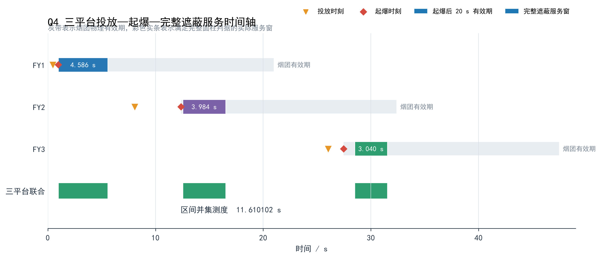
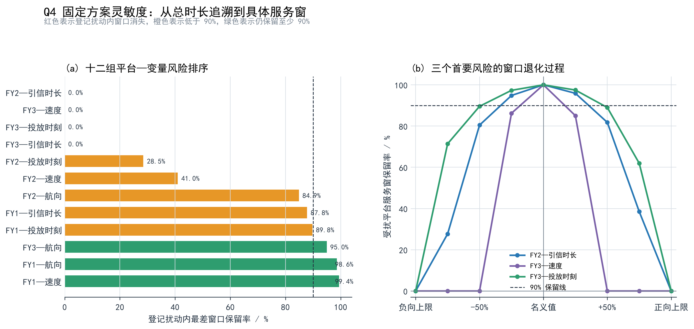

# 问题四：三架无人机各投一枚烟幕弹的联合优化模型

## 1 问题重述

无人机 FY1、FY2、FY3 的初始位置分别为 `(17800,0,1800)`、`(12000,1400,1400)` 和
`(6000,-3000,700) m`。三架无人机接到任务后，各自立即选择一个水平飞行方向，并以
`70～140 m/s` 的速度保持等高度匀速直线飞行；每架无人机投放一枚烟幕弹。

烟幕弹离机后做平抛运动，在设定的引信延迟后起爆。起爆后形成半径为 `10 m` 的球形烟幕
云团，云团中心以 `3 m/s` 的速度匀速下沉，并在起爆后的 `20 s` 内有效。来袭导弹 M1 从
`(20000,0,2000)` 出发，以 `300 m/s` 的速度飞向位于原点的假目标；需要保护的真目标为
底面圆心 `(0,200,0)`、半径 `7 m`、高度 `10 m` 的竖直圆柱。

问题四要求分别确定 FY1、FY2、FY3 的飞行航向、速度、烟幕弹投放时刻和引信延迟，使三枚
烟幕弹对 M1 的联合有效遮蔽时间最长，并把三架无人机的航向、速度、投放点、起爆点和单弹
有效时长填入 `result2.xlsx`。

三架无人机的航向和速度彼此独立，每架无人机只投放一枚烟幕弹，因此平台之间
不设投放时间间隔。三枚烟幕弹的有效遮蔽时段可以连续，也可以分成多个不连续区间；
联合有效遮蔽时长按所有完整遮蔽区间的并集长度计算。

## 2 问题分析

对每架无人机，需要独立确定航向、速度、投放时刻和引信延迟，共形成十二个连续决策变量。
三组变量分别受 FY1、FY2、FY3 的真实初始位置约束，同一组控制量从不同起点出发会产生
不同的可达起爆区域，因此必须分平台建立物理可达烟幕服务事件。

如果直接在十二维长方体中随机搜索，绝大多数起爆点都会远离导弹通向真目标的视线束，严格
完整遮蔽时长为零；即使三个单弹方案分别可行，把它们直接拼接也不保证联合时间结构合理。

因此，本问仍沿用一条统一求解主链。首先，根据导弹视线、烟团下沉和烟幕弹自由落体关系，
为 FY1、FY2、FY3 分别生成物理可达航迹和服务事件；其次，对每个平台的事件库进行压缩，
从三个事件库中各取一个事件形成三资源组合；然后使用完整可见圆柱、有限视线段和连续时间
联合判据统一筛选；最后返回十二个原始变量作多尺度连续精修，并用更密的目标表面和时间根
求解独立复核。

候选阶段使用圆柱中心视线提高非零方案命中率，但中心视线不是正式目标。正式时长始终由完整
可见圆柱上的最坏联合遮蔽余量、连续时间边界和区间并集共同决定。

## 3 模型假设

在题目条件基础上作如下假设：

1. FY1、FY2、FY3 接到任务后立即转入各自给定航向，此后保持等高度、等速度直线飞行；
2. 烟幕弹离机瞬间继承所属无人机的水平速度，忽略空气阻力，竖直方向仅受恒定重力作用，
   重力加速度取 `g=9.8 m/s²`；
3. 烟幕弹起爆后立即形成半径为 `10 m` 的球形有效烟团，球心仅以 `3 m/s` 匀速下沉，
   有效期为 `20 s`；
4. 导弹 M1 按题目给定方向和速度做匀速直线运动，不考虑中途机动；
5. 真目标按半径 `7 m`、高度 `10 m` 的完整竖直圆柱处理，只评价导弹视点当前可见的圆柱
   表面；
6. 对任一可见目标点，若导弹到该点的有限视线段与至少一个有效烟团相交，则该点被遮蔽；
   所有可见目标点均被遮蔽时，才认定该时刻发生完整遮蔽；
7. 三架无人机各投一枚烟幕弹，各自的航向、速度、投放时刻和引信延迟彼此独立，不设置跨
   平台投放间隔；
8. 不额外考虑风场、烟幕扩散、浓度衰减、无人机转弯过程和随机控制误差。

## 4 主要符号说明

| 符号 | 含义 | 单位 |
|---|---|---:|
| `i` | 无人机编号，`i=1,2,3` 分别对应 FY1、FY2、FY3 | — |
| `U_i0` | 第 `i` 架无人机的初始位置向量 | m |
| `M_0`、`M(t)` | M1 初始位置与时刻 `t` 的位置 | m |
| `θ_i` | 第 `i` 架无人机的水平航向角 | rad |
| `v_i` | 第 `i` 架无人机的飞行速度 | m/s |
| `h_i` | 第 `i` 架无人机的水平航向单位向量 | — |
| `τ_i` | 第 `i` 架无人机的烟幕弹投放时刻 | s |
| `δ_i` | 第 `i` 枚烟幕弹的引信延迟 | s |
| `t_i^e` | 第 `i` 枚烟幕弹的起爆时刻 | s |
| `R_i`、`E_i` | 第 `i` 枚烟幕弹的投放点、起爆点 | m |
| `C_i(t)` | 第 `i` 个烟团在时刻 `t` 的球心位置 | m |
| `R_s` | 烟团有效半径，`R_s=10` | m |
| `V(t)` | 时刻 `t` 从 M1 观察到的圆柱可见表面点集 | — |
| `A(t)` | 时刻 `t` 仍处于有效期内的烟团编号集 | — |
| `d_seg` | 点到导弹—目标点有限视线段的距离 | m |
| `Φ_4(t;x)` | 三烟团联合完整遮蔽余量 | m |
| `Ω_4(x)` | 决策 `x` 对应的完整遮蔽时间集合 | s |
| `J_4(x)` | 三烟团联合有效遮蔽总时长 | s |

## 5 模型建立

### 5.1 三条独立航迹与烟幕弹运动模型

对平台 `i∈{1,2,3}`，令其水平航向单位向量为

```text
h_i=(cosθ_i,sinθ_i,0)。                                      (1)
```

第 `i` 架无人机在时刻 `t` 的位置为

```text
U_i(t)=U_i0+v_i t h_i。                                      (2)
```

该无人机在 `τ_i` 时刻投放一枚烟幕弹，因此投放点为

```text
R_i=U_i0+v_i τ_i h_i。                                      (3)
```

烟幕弹经过 `δ_i` 秒起爆，起爆时刻和起爆点分别为

```text
t_i^e=τ_i+δ_i，                                              (4)
E_i=U_i0+v_i t_i^e h_i-(0,0,gδ_i²/2)。                      (5)
```

起爆后烟团只做竖直匀速下沉，因此在有效期内有

```text
C_i(t)=E_i-(0,0,3(t-t_i^e))，
t_i^e≤t≤t_i^e+20。                                          (6)
```

导弹 M1 从 `M_0=(20000,0,2000)` 出发，以 `v_M=300 m/s` 飞向原点，故其轨迹为

```text
M(t)=M_0-v_M t M_0/||M_0||。                                (7)
```

于是问题四的原始决策向量为

```text
x=(θ_1,v_1,τ_1,δ_1,
   θ_2,v_2,τ_2,δ_2,
   θ_3,v_3,τ_3,δ_3)∈R^12。                                 (8)
```

式（8）中的三组四变量分别绑定 FY1、FY2、FY3 的真实起点。更换平台标签时必须同时更换
对应起点，不能只交换控制量或把 FY1 的局部航迹平移到另外两个位置。

### 5.2 多烟团联合完整遮蔽判据

对时刻 `t` 的任一可见目标点 `P∈V(t)`，导弹通向该点的有限视线段可写为

```text
L(λ;t,P)=M(t)+λ(P-M(t))，0≤λ≤1。                            (9)
```

烟团球心 `C_i(t)` 到该有限线段的距离为

```text
d_seg(C_i,M,P)=||C_i-[M+λ_i(P-M)]||，
λ_i=clip(((C_i-M)·(P-M))/||P-M||²,0,1)。                   (10)
```

式（10）使用有限线段而非无限直线，因此位于导弹后方或目标后方的烟团不会因接近视线延长
线而被误判为有效。时刻 `t` 的有效烟团集合定义为

```text
A(t)={i:t_i^e≤t≤t_i^e+20}。                                 (11)
```

对每个目标点，只要至少有一个有效烟团截断其视线即可；对完整圆柱，则要求所有可见目标点均
满足这一条件。因此定义联合完整遮蔽余量

```text
Φ_4(t;x)=max_{P∈V(t)} min_{i∈A(t)}
          [d_seg(C_i(t),M(t),P)-R_s]。                       (12)
```

当 `A(t)` 为空时令 `Φ_4(t;x)=+∞`。由式（12）可知

```text
Φ_4(t;x)≤0
⇔ 时刻 t 的全部可见圆柱表面均被至少一个有效烟团遮蔽。      (13)
```

式（12）的量词顺序是“先对每个目标点选择最有利烟团，再找完整可见表面上最不利的点”。
它既允许不同烟团分工遮住圆柱的不同部分，也自然包含某个烟团单独完成完整遮蔽的情形。当只有
一个烟团有效时，内层最小值退化为单烟团余量，模型便回到问题二的完整圆柱判据。

### 5.3 连续时间目标与约束

定义完整遮蔽时间集合

```text
Ω_4(x)={t∈[0,t_M]:Φ_4(t;x)≤0}，                            (14)
```

其中 `t_M=||M_0||/v_M` 为 M1 到达假目标的时刻。问题四的目标函数为该集合的测度：

```text
max J_4(x)=μ(Ω_4(x))。                                      (15)
```

如果 `Ω_4(x)` 由若干互不重叠区间 `[a_k,b_k]` 构成，则

```text
J_4(x)=Σ_k(b_k-a_k)。                                       (16)
```

因此，同时生效的多个烟团不会被重复计时，多个不连续服务窗口则全部计入区间并集。决策变量
满足

```text
0≤θ_i<2π，70≤v_i≤140，τ_i≥0，δ_i≥0，                       (17)
E_{i,z}≥0，t_i^e≤t_M，i=1,2,3。                             (18)
```

式（17）—（18）分别约束三个平台的航向、速度和投爆可行性；三枚烟幕弹的联合作用则由
式（12）的完整遮蔽余量和式（15）的时间并集目标统一评价。

### 5.4 各平台的物理服务事件生成

直接搜索十二维原变量会产生大量严格零值候选。为提高命中率，先对每个平台生成能够在计划
观察时刻把烟团送入导弹视线邻域的物理服务事件。

记真目标圆柱中心代表点为 `P_c=(0,200,5)`。固定第 `i` 个平台的航迹 `(θ_i,v_i)`，并选取
计划观察时刻 `t`，令候选烟团球心位于 M1 到 `P_c` 的中心视线附近。水平方向满足

```text
U_i0,xy+v_i t_i^e h_i,xy
=M_xy(t)+q[P_c,xy-M_xy(t)]。                                 (19)
```

式（19）是关于起爆时刻 `t_i^e` 和视线比例 `q` 的二元线性关系。解得二者后，令相应视线点
和烟团年龄为

```text
G(t,q)=M(t)+q[P_c-M(t)]，                                   (20)
a=t-t_i^e。                                                  (21)
```

由于烟团从起爆到观察时刻已经下沉 `3a`，相应起爆高度应为

```text
E_{i,z}=G_z(t,q)+3a。                                        (22)
```

再由自由落体关系反解引信延迟和投放时刻：

```text
δ_i=sqrt[2(U_i0,z-E_{i,z})/g]，
τ_i=t_i^e-δ_i。                                              (23)
```

只保留满足

```text
0<q<1，0≤a≤20，0≤E_{i,z}≤U_i0,z，τ_i≥0                     (24)
```

并能回代通过式（17）—（18）的事件。当观察时刻 `t` 连续变化时，固定航迹下便形成一条
服务事件曲线 `(τ_i(t),δ_i(t))`。

反向锚点构造也可从 `(t,a,q)` 出发，先确定起爆时刻和目标烟团位置，再由式（22）—（23）
及水平位移反解航向和速度。无论采用哪一种方向，中心视线都只负责构造候选；每个事件最终必须
返回四个原变量，并用式（12）重新评价完整可见圆柱。

### 5.5 三平台事件组合与原变量精修

FY1、FY2、FY3 分别建立事件库后，组合层恰好从每个平台各取一个事件。先在共同时间网格上
合并三个事件的低成本完整覆盖掩码，按代理联合时长、时间跨度、硬约束余量和确定性原序号排序，
保留有限组合束。同步事件、时间接力事件和几何互补事件都属于同一个事件库，不另建并列算法。

所有入围组合均调用式（12）—（16）的严格联合评价器。代理高分而严格归零的组合直接淘汰，
最终排序只认 `J_4`，不以三个单弹时长之和代替联合时长。

为进行连续精修，将十二个原变量分别缩放到单位区间。在两个模式半径下依次尝试各坐标正负
移动，每次都还原到原变量并复核式（17）—（18）。只有严格联合时长增加超过数值容差时才
接受新点；若时长数值相同，则按硬约束余量和确定性字典序破平。该保优规则保证连续精修不会
因代理误差降低当前最好严格结果。

### 5.6 求解算法

综合上述模型，本问采用如下唯一主求解链：

```text
FY1、FY2、FY3 分别生成物理可达航迹锚点
→ 沿各航迹构造服务事件曲线
→ 压缩三个平台各自的事件库
→ 从 FY1、FY2、FY3 各取一个事件形成组合
→ 用完整可见圆柱与有限视线段判据严格筛选
→ 返回十二个原变量作多尺度保优精修
→ 对优胜方案进行高精度表面、连续时间根和表格回读复核。
```

候选生成、事件压缩、资源组合和连续精修是同一求解链的连续步骤。历史上的独立单弹组合、
边际贪心、分域样本或同步事件若被使用，只充当回归下界、排序特征、覆盖守卫或事件多样性
来源，不具有独立算法身份。

## 6 模型求解

### 6.1 三平台航迹与服务事件库

首先在计划观察时刻、烟团年龄和视线比例的确定性网格上，为三架无人机分别反解物理可达
航迹。FY1、FY2、FY3 分别得到 `24`、`422`、`2652` 个原始航迹锚点；去重后为 `24`、
`422`、`2649` 条，再按服务时段、航向和速度的覆盖多样性保留 `24`、`42`、`46` 条航迹。

对保留航迹扫描观察时刻，FY1、FY2、FY3 分别产生 `181`、`1536`、`1679` 个服务曲线
事件。去除原变量重复事件后，各平台分别剩余 `157`、`1479`、`1457` 个事件；经代理服务
时长、时间槽位、航向速度覆盖和可行守卫共同压缩，最终事件库规模为 `32`、`33`、`34`。

这些数字反映三个真实起点对应的可达区域差异。FY3 的起点更低且水平位置与 FY1 明显不同，
因而需要独立生成候选，不能把 FY1 的服务事件简单平移或换标签。

### 6.2 三资源组合与原变量精修

从三个事件库中各取一个事件，根据共同时间格上的代理覆盖形成组合束，最终保留 `24` 个组合
进入完整圆柱严格快速评价。按严格联合时长排序后，取前 `4` 个组合返回十二个原变量作连续
精修；精修模式半径为 `0.015` 和 `0.006`。

本次最优组合在两个模式半径下均未接受新的坐标移动。这表明在本轮候选、步长和数值容差
下，单坐标移动未带来可辨识的改进；后续仍需通过数值加密和局部敏感性检验识别更小尺度的变化。

快速严格层使用 `32` 个角向节点、`5` 个表面层和 `0.08 s` 时间发现步长；筛选层使用
`96×9` 表面与 `0.03 s` 步长；精确层使用 `256×17` 表面、`0.01 s` 步长和连续边界求根；
最终加密层使用 `512×33` 表面再次复算。所有层级使用相同的式（12），差别只在数值精度。

### 6.3 最佳决策的运动参数

求得三架无人机的航向分别为

```text
(θ_1,θ_2,θ_3)
=(0.100000000000,5.353469119324,1.314876115069) rad，          (25)
```

即

```text
(5.729577951°,306.731186291°,75.336851976°)。                (26)
```

对应速度为

```text
(v_1,v_2,v_3)
=(120.000000000,137.750286959,115.770558307) m/s。            (27)
```

三枚烟幕弹的投放时刻和引信延迟为

```text
(τ_1,τ_2,τ_3)
=(0.476301948,8.069104003,26.043456305) s，                   (28)

(δ_1,δ_2,δ_3)
=(0.500311794,4.305476024,1.427722079) s。                    (29)
```

由式（4）得到起爆时刻

```text
(t_1^e,t_2^e,t_3^e)
=(0.976613742,12.374580027,27.471178384) s。                  (30)
```

三组速度均位于 `[70,140] m/s`，投放时刻和引信延迟均非负，最低起爆高度为
`690.011887 m`，全部硬约束满足。

### 6.4 联合完整遮蔽区间

将式（25）—（30）代入联合余量式（12），对起爆、失效和导弹到达事件分段扫描，并对余量
符号变化位置连续求根。最终加密层得到三个互不重叠的完整遮蔽区间：

```text
I_1=[0.985450800829,5.571338399623] s，
I_2=[12.529898857522,16.514269671755] s，
I_3=[28.493633614252,31.533477549811] s。                    (31)
```

由式（16）可得

```text
J_4=(5.571338399623-0.985450800829)
   +(16.514269671755-12.529898857522)
   +(31.533477549811-28.493633614252)
   =11.610102348586 s。                                      (32)
```

三个服务窗口在时间上明显分离。这是三个真实平台独立可达服务事件联合优化后形成的结果，
不是模型预先强制的轮流接力结构。

图 1 将三架无人机的投放时刻、起爆时刻、烟团物理有效期和实际完整遮蔽服务窗放在同一时间轴上。
灰色有效期明显长于彩色服务窗，说明决定结果的不是“烟团是否存在”，而是烟团在下沉过程中是否仍能
覆盖完整圆柱对应的全部可见视线段。



## 7 模型结果

表 1 汇总三架无人机的航迹与投爆决策。

表 1　FY1、FY2、FY3 各投放一枚烟幕弹的 Q4 决策结果

| 平台 | 航向角 | 速度/(m/s) | 投放时刻/s | 引信延迟/s | 起爆时刻/s |
|---|---:|---:|---:|---:|---:|
| FY1 | `0.100000000 rad（5.729577951°）` | `120.000000000` | `0.476301948` | `0.500311794` | `0.976613742` |
| FY2 | `5.353469119 rad（306.731186291°）` | `137.750286959` | `8.069104003` | `4.305476024` | `12.374580027` |
| FY3 | `1.314876115 rad（75.336851976°）` | `115.770558307` | `26.043456305` | `1.427722079` | `27.471178384` |

表 2 给出三枚烟幕弹的投放点、起爆点和各自单独形成完整遮蔽的时长。

表 2　三枚烟幕弹的空间位置与单弹服务时长

| 平台 | 投放点 `(x,y,z)`/m | 起爆点 `(x,y,z)`/m | 单弹完整遮蔽时长/s |
|---|---|---|---:|
| FY1 | `(17856.870691,5.706102,1800.000000)` | `(17916.608169,11.699842,1798.773472)` | `4.585894` |
| FY2 | `(12664.758115,509.170918,1400.000000)` | `(13019.456744,33.846365,1309.168093)` | `3.984371` |
| FY3 | `(6763.220881,-83.132894,700.000000)` | `(6805.061230,76.771979,690.011887)` | `3.039844` |

三枚烟幕弹单独形成完整遮蔽的精确层区间分别为

```text
I_1^(单)=[0.985444461411,5.571338321274] s，
I_2^(单)=[12.529898782909,16.514269739330] s，
I_3^(单)=[28.493633675662,31.533477425662] s。               (33)
```

本方案中三个单弹区间彼此分离，因此联合时长表现为三个服务窗的时间并集，
形成 FY1、FY2、FY3 依次延长对 M1 遮蔽时间的接力结构。

表 3 汇总正式联合结果。

表 3　三烟团联合完整遮蔽结果

| 结果项 | 数值 | 单位 |
|---|---:|---:|
| 第一遮蔽区间 | `[0.985450800829,5.571338399623]` | s |
| 第二遮蔽区间 | `[12.529898857522,16.514269671755]` | s |
| 第三遮蔽区间 | `[28.493633614252,31.533477549811]` | s |
| 联合完整遮蔽总时长 | `11.610102348586` | s |

按六位小数报告，问题四得到的联合有效遮蔽时间为
`11.610102 s`。`result2.xlsx` 的三行依次对应 FY1、FY2、FY3；表内逐行时长是对应烟幕弹
单独形成完整遮蔽的时长，联合总时长按式（32）单独报告。

## 8 模型检验与敏感性分析

### 8.1 模型与结果检验

本问从平台身份、运动学回代、联合几何、时间区间和结果表回读五个方面检验模型与数值结果。

表 4　模型与数值求解检验

| 检验对象 | 检验方法 | 指标与结果 | 结论 |
|---|---|---:|---|
| 平台与决策变量 | 由三个初始位置分别重构航向、速度、投放和起爆过程 | 三个平台分别绑定 `4` 个控制量，共 `12` 个原变量 | 平台起点和控制量对应正确 |
| 运动学与硬约束 | 将表 1 参数回代式（3）—（6） | 最大空间残差 `0 m`，时间残差 `0 s`；所有起爆点均在地面上方 | 通过 |
| 联合完整遮蔽几何 | 在 `21` 个代表时刻逐点计算式（12），与批量几何计算比较 | 最大余量差 `3.255×10^-10 m` | `max_P min_i` 与有限视线段实现一致 |
| 单烟团退化 | 在式（12）中只保留一个有效烟团 | 内层最小值退化为单烟团余量 | 单弹与三弹使用同一几何判据 |
| 烟团标签置换 | 在代表时刻改变三枚烟团的遍历顺序 | 联合余量最大差 `0 m` | 结果不依赖烟团编号或计算顺序 |
| 联合量词反例 | 构造两烟团分别遮住两个表面点的余量矩阵 | 两个单云最坏余量均为 `+1 m`，组合后为 `-1 m` | 模型允许烟团分担圆柱表面，不要求某一团单独遮住全部目标 |
| 表面与时间加密 | 使用 `1024×65` 表面和 `0.005 s` 扫描复算 | 时长 `11.610099387321 s`，与正式值相差 `-2.961×10^-6 s` | 三个区间在数值加密后保持稳定 |
| 时间边界 | 检查六个进入、退出边界的遮蔽余量 | 最大绝对余量 `1.624×10^-7 m` | 连续时间根满足预设精度 |
| 资源子集与区间并集 | 分别计算三个单平台、三个双平台和三平台方案 | 新增烟团后联合时长不降低；区间并集未重复计时 | 符合资源单调性 |
| 结果表回读 | 从 `result2.xlsx` 重构三组决策和空间点 | 时间残差 `7.305×10^-14 s`，空间残差 `3.638×10^-12 m` | 表格与计算结果一致 |

精确层的联合时长为 `11.610108729594 s`，加密层为 `11.610102348586 s`，进一步独立加密后为
`11.610099387321 s`。三次复算均保留相同的三段遮蔽结构，总时长只在微秒量级变化。

结构复核进一步枚举了三个单平台、三个双平台和三平台共七个非空资源子集，并检查全部 `12` 个
严格包含关系。新增烟团后遮蔽时长均不降低，单云退化的时长差为 `0 s`。当前三个单平台时长分别为
`4.585894 s`、`3.984370 s` 和 `3.039844 s`，其服务窗两两交叠总长为 `0 s`；因此当前结果是
三个平台依次承担不同时段的时间接力型方案。这里需要区分“模型能力”和“本次解的形态”：式（12）能够
表达多个烟团同时分担圆柱表面的空间拼接，但当前最优工作解并未采用这种形态。

### 8.2 固定方案的局部敏感性

以表 1 的方案为基准，每次只改变某一平台的一项控制量，其余十一个变量保持不变。航向角分别扰动
`±0.1°、±0.2°`，速度分别扰动 `±0.5、±1 m/s`，投放时刻和引信延迟分别扰动 `±0.05、±0.1 s`，
共得到 `48` 个扰动情景。

由于名义方案的三个遮蔽区间彼此分离，单看联合总时长会掩盖变化机制。因此，本文对每个情景同时记录
联合区间数、受扰平台的单独服务窗、入口和出口漂移以及窗口长度保留率。若某个平台的窗口消失，联合结果就会
直接少掉对应的一整段；若窗口仍存在，则可以继续判断其主要是整体平移还是两端向内收缩。

48 个扰动情景表明，当前固定方案不能作统一的局部稳定性声明。最差情景为 FY2 引信时长减少 `0.1 s`：
FY2 的 `3.984370 s` 服务窗完全消失，联合时长从灵敏度层名义值 `11.610109 s` 降为 `7.625737 s`。
这并不是重新优化后的最好结果，而是原方案在参数偏离后失去第二段服务窗。

表 5　高风险服务窗及临界偏移

| 平台—控制量 | 名义窗口/s | 90% 保留边界 | 窗口消失边界 | 主要作用机制 |
|---|---:|---:|---:|---|
| FY2—引信时长 | `3.984370` | `-0.0352/+0.0383 s` | `-0.0777/+0.0805 s` | 同时改变起爆时刻、起爆高度和随后下沉轨迹，第二服务窗对这一组合偏移最敏感 |
| FY3—飞行速度 | `3.039844` | `-0.2148/+0.2109 m/s` | `-0.4375/+0.3750 m/s` | 改变起爆点的水平位置，使第三个烟团可能整体错过关键视线束 |
| FY3—投放时刻 | `3.039844` | `-0.0492/+0.0480 s` | `-0.0996/+0.0863 s` | 改变起爆时刻与水平位置，导致第三服务窗先缩短、后消失 |

上述临界值先在 `128×9` 表面、`0.02 s` 时间扫描下二分定位，再用 `256×17` 表面、`0.01 s`
时间扫描复核。加密复算在三组 90% 边界上得到约 `89.69%—89.90%` 的窗口保留率，并在六个窗口消失
边界上均复现零窗口，说明风险排序和突变判断不是粗网格偶然造成的。

图 2 左侧把十二组平台—变量组合按最差窗口保留率排序，右侧进一步展示三个首要风险随正、负扰动幅度
增加而发生的窗口退化。它直观说明当前方案的风险集中在少数控制量，而不是十二个变量平均分布。



相比之下，FY1 的速度最不敏感：在 `±1 m/s` 范围内最差仍保留其名义窗口的 `99.44%`；FY1 航向在
`±0.2°` 范围内最差保留 `98.64%`。因此，这项分析给出的不是“十二个变量都要同等精确”，而是明确的
控制优先级：先保证 FY2 引信时序，再保证 FY3 速度与投放时刻。不同平台服务窗的稳定程度差异，也可为
下一问考虑资源分工时提供启发，但这里不建立下一问的变量、目标或数值方案。

## 9 模型评价

### 9.1 模型优点

1. **平台身份正确。** FY1、FY2、FY3 分别绑定各自的真实起点和四个独立控制量，
   能够反映三个平台可达服务区域的差异。
2. **候选生成具有物理依据。** 服务事件由导弹视线、烟团下沉和烟幕弹自由落体关系反推，
   避免在十二维零值平台上进行大规模盲搜。
3. **联合语义完整。** `max-min` 判据同时保留完整可见圆柱、有限视线段和多烟团分工关系，
   单团独立遮蔽与多团互补遮蔽都由同一公式处理。
4. **求解路线统一。** 航迹锚点、事件曲线、事件库压缩、资源组合、严格筛选和原变量精修是
   同一求解过程中的连续步骤。
5. **结果可复核。** 运动学回代、独立逐点几何、表面时间加密、资源单调和 Excel 回读均给出
   了明确数值指标。
6. **结果机制清晰。** 单平台、双平台和三平台结果的对照表明，当前方案主要依靠三个平台
   对不同时段的接力遮蔽。

### 9.2 模型局限

1. 服务事件曲线以中心视线作为候选生成依据，对远离中心视线但仍可能产生完整遮蔽的小幅偏移
   方案，主要依赖事件库的多样性守卫进行补充。
2. 原变量精修采用固定起点数和两个模式半径，进一步增加多变量联动精修可能找到更好的邻域解。
3. 联合遮蔽目标由区间出现、消失和拼接构成，具有明显非光滑性；局部敏感性中整段服务窗的
   消失正体现了这种结构。
4. 当前灵敏度分析固定其余变量，反映的是既定方案的局部响应；临界偏移虽经加密复核，仍不能代替
   扰动后的重新优化，也不能解释为控制误差的概率分布。
5. 模型按题面采用理想球形烟团，未进一步描述风、空气阻力、烟幕扩散、浓度衰减和无人机转弯过程。

## 10 问题四结论

本文将问题四统一表述为“三个真实平台各自产生一个物理可达烟幕服务事件，再对三个资源进行
严格联合评价”的十二变量优化问题。三架无人机分别采用独立航向和速度，每架投放一枚烟幕弹；
候选由物理服务事件曲线生成，三个事件库各取一个事件形成组合，最终返回原始十二变量，并以
完整可见圆柱、有限视线段和连续时间区间并集作为唯一正式目标。

得到三架无人机的执行参数为

```text
(θ_1,θ_2,θ_3)
=(5.729577951°,306.731186291°,75.336851976°)，               (34)

(v_1,v_2,v_3)
=(120.000000000,137.750286959,115.770558307) m/s，           (35)

(τ_1,τ_2,τ_3)
=(0.476301948,8.069104003,26.043456305) s，                  (36)

(δ_1,δ_2,δ_3)
=(0.500311794,4.305476024,1.427722079) s。                   (37)
```

三枚烟幕弹形成的联合完整遮蔽时间集合为

```text
[0.985450800829,5.571338399623]
∪[12.529898857522,16.514269671755]
∪[28.493633614252,31.533477549811] s，                      (38)
```

联合有效遮蔽总时长为

```text
J_4=11.610102348586 s≈11.610102 s。                          (39)
```

运动学重构、独立有限线段几何、表面与时间加密以及结果表回读均表明该方案在当前数值精度下
稳定可复现。当前方案以三个分离时间窗实现接力遮蔽，联合完整遮蔽时长为 `11.610102 s`。
灵敏度分析进一步表明，FY2 的引信延迟以及 FY3 的速度和投放时刻是该方案中需要优先控制的变量。
