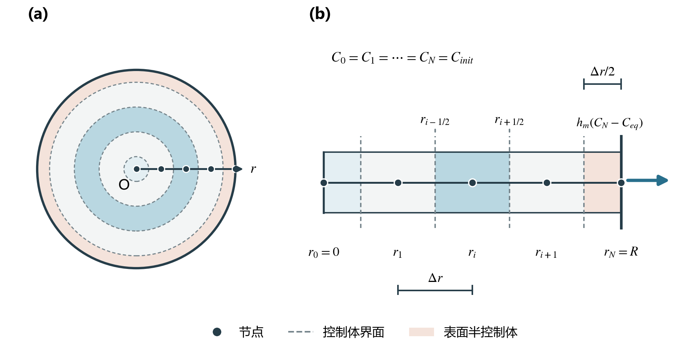
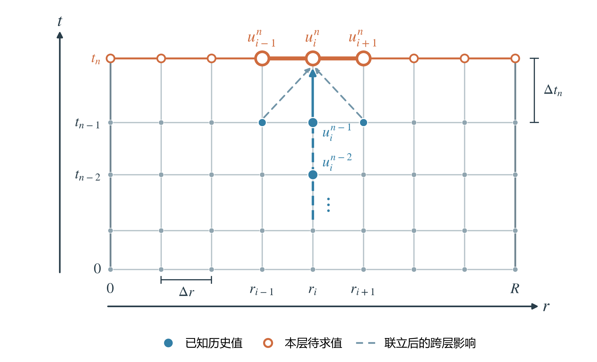
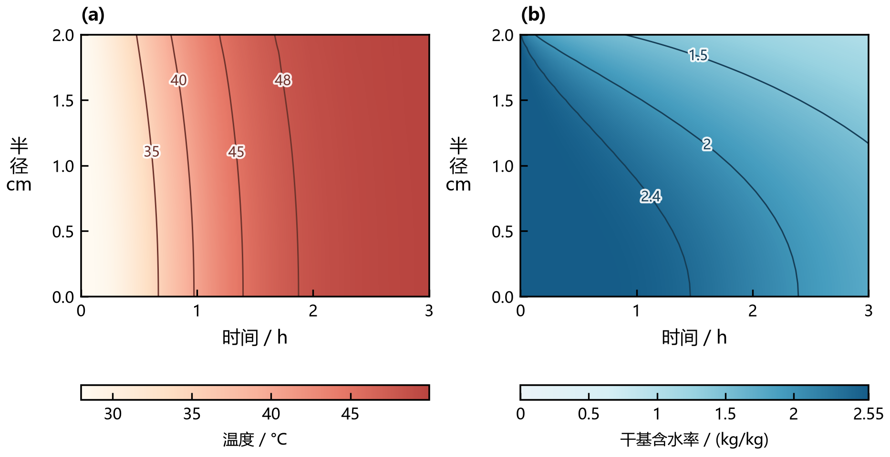
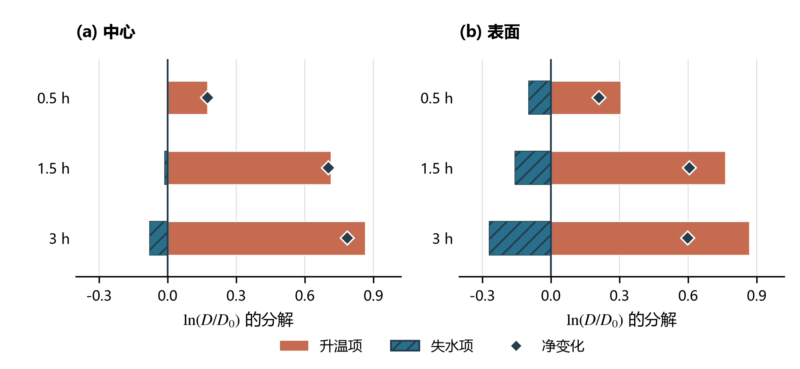
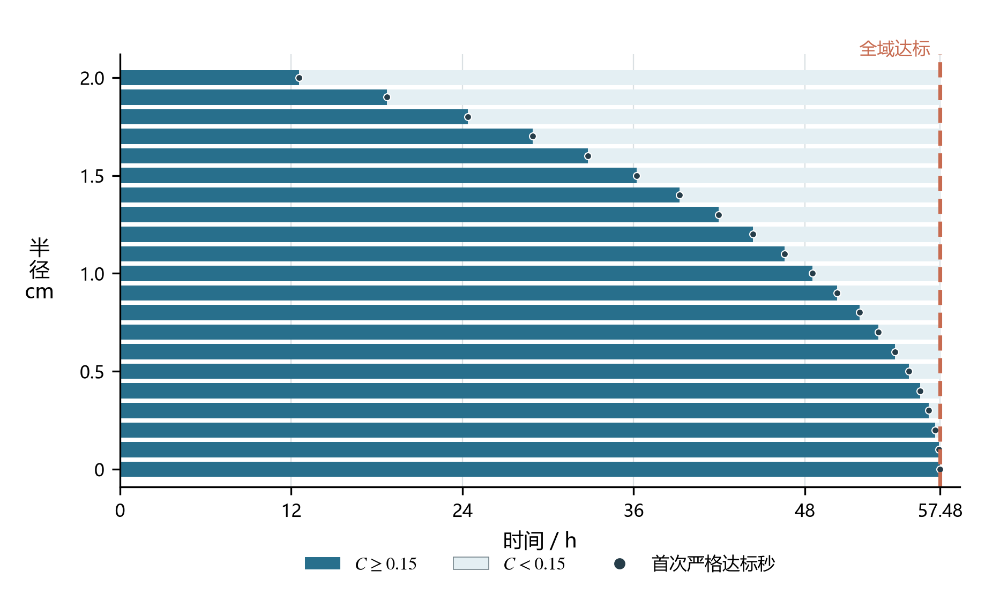
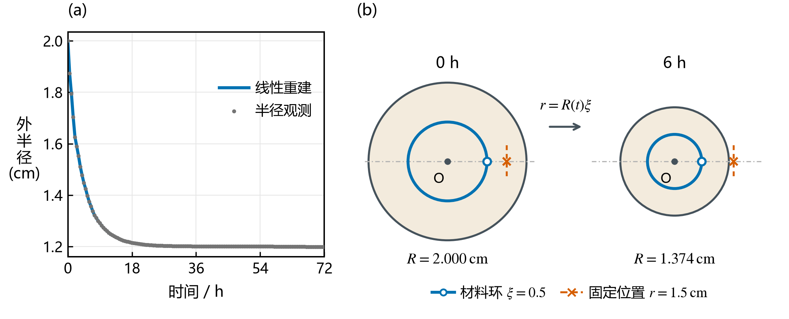
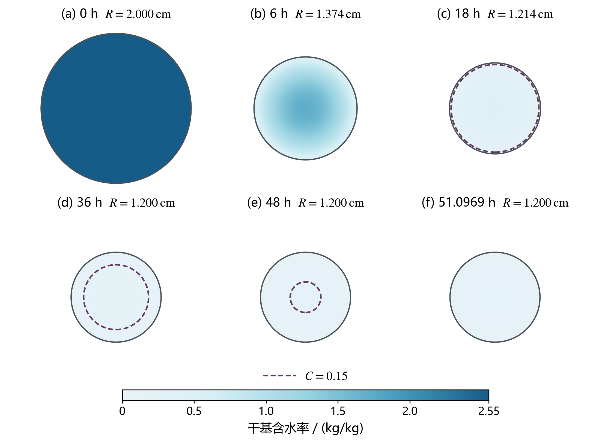

# 当前讲解稿选用图件

本目录直接依据四问讲解稿中的实际图片引用生成。旧版图仍留在原生产目录，取图请以本页为准。

[A4预览册](figure_catalog.pdf) · [当前图件打包](论文图件_当前选用.zip)

每幅均提供PDF、SVG和PNG。图号按问题内部编号；队伍合稿时统一连续编号。

## 图1-1　问题1 · 5.4 圆环控制体、端点处理与初始变化率

[PDF](../structural_rebuild_20260912/fig01_annular_control_volumes.pdf) · [SVG](../structural_rebuild_20260912/fig01_annular_control_volumes.svg) · [PNG](../structural_rebuild_20260912/fig01_annular_control_volumes.png)

图1-1 圆柱截面与径向控制体划分。(a)圆形截面中的节点与环带；(b)对应的径向控制体。圆点表示状态节点，虚线位于相邻节点中点；蓝色环带标出一个内部控制体，浅橙环带为真实边界截断的表面半控制体，填色不表示含水率。箭头表示均匀初态下的表面向外水分交换，此时内部面通量为零；节点数、间距及箭头长度用于示意。

## 图1-2　问题1 · 5.5 非线性处理：隐式BDF与解析稀疏Jacobian

[PDF](../spacetime_grid_20260912/fig01_spacetime_grid.pdf) · [SVG](../spacetime_grid_20260912/fig01_spacetime_grid.svg) · [PNG](../spacetime_grid_20260912/fig01_spacetime_grid.png)

图1-2 径向—时间计算网格与隐式耦合示意。交点表示uiⁿ≈u(ri,tn)，蓝色实心点为已知历史，橙色空心点为本层未知；粗横线表示本层相邻节点直接耦合，竖箭头表示同列历史输入。斜虚线表示整层联立后的跨层影响，不是额外差分项或全部影响路径；节点数和时间间距仅为示意。

## 图1-3　问题1 · 7.2 热量与水分向内部传播的差异

[PDF](../v1/fig03_q1_profiles.pdf) · [SVG](../v1/fig03_q1_profiles.svg) · [PNG](../reading/fig03_q1_profiles_d98d193909de.png)

图1-3 预热阶段温度与含水率的径向响应。(a)温度；(b)干基含水率。五个时刻为100、600、900、1200、1800 s，以不同标记与线型区分；曲线连接21个规定半径的未舍入值，稀疏标记用于辨认，未额外拟合。

## 图2-1　问题2 · 7.2 温度趋于均匀与水分梯度持续

[PDF](../redesign_v3/fig04_q2_fields_sample.pdf) · [SVG](../redesign_v3/fig04_q2_fields_sample.svg) · [PNG](../redesign_v3/fig04_q2_fields_sample.png)

图2-1 前三小时温度与含水率的时空分布。横轴为时间，纵轴为实际半径，0为中心、2 cm为表面；(a)温度，(b)干基含水率，细线为对应状态的等值线。色场对逐秒21个规定半径作双线性显示内插，等值线由同一原网格线性定位；含水率色标为0～2.55 kg/kg，显示内插不增加计算分辨率。

## 图2-2　问题2 · 7.3 升温与变干对扩散能力的竞争

[PDF](../structural_rebuild_20260912/fig09_q2_diffusivity_decomposition.pdf) · [SVG](../structural_rebuild_20260912/fig09_q2_diffusivity_decomposition.svg) · [PNG](../structural_rebuild_20260912/fig09_q2_diffusivity_decomposition.png)

图2-2 升温与变干对局部扩散系数变化的分解。取主方案0.5、1.5、3 h的中心和表面状态，正、负条分别表示Aθ、AC，净值点为ln(D/D0)。各值由未舍入温湿结果代入式（16）计算，不拟合参数，也不额外求解扰动情景。

## 图3-1　问题3 · 7.2 径向干燥进程与表5

[PDF](../structural_rebuild_20260912/fig05_q3_completion_progress.pdf) · [SVG](../structural_rebuild_20260912/fig05_q3_completion_progress.svg) · [PNG](../structural_rebuild_20260912/fig05_q3_completion_progress.png)

图3-1 规定径向位置的未达标与达标时段。 每条时段带对应一个固定半径，依据主轨迹该位置的逐秒未舍入含水率与0.15 kg/kg比较，展示到结束秒206927 s。图展示0、0.1、…、2 cm的21个规定位置；全域终点仍由全部10241节点的最大值确定。

## 图4-1　问题4 · 5.2 材料坐标与时间导数的变换

[PDF](../brief_refresh_20260911/fig06_q4_coordinates.pdf) · [SVG](../brief_refresh_20260911/fig06_q4_coordinates.svg) · [PNG](../brief_refresh_20260911/fig06_q4_coordinates.png)

图4-1 外半径观测与均匀径向缩放下的材料坐标对应。 （a）0～72 h半径观测及线性重建。（b）0 h、6 h截面保持相同厘米尺度，蓝色材料环保持ξ=0.5，物理半径由1.000 cm缩到0.687 cm；橙色叉号为固定r=1.5 cm，6 h已在药材外。填色表示材料范围，蓝环由均匀缩放假设确定，不表示等含水率线。

## 图4-2　问题4 · 7.2 表6与收缩过程中的内部干燥

[PDF](../redesign_v3/fig07_q4_sections_sample.pdf) · [SVG](../redesign_v3/fig07_q4_sections_sample.svg) · [PNG](../redesign_v3/fig07_q4_sections_sample.png)

图4-2 问题4同尺度的含水率截面序列。 六幅为0、6、18、36、48 h及结束秒183949 s。完整10241节点场按r=R(t)ξ映射到截面，保持相同厘米尺度和0～2.55 kg/kg线性色标；实线是实际表面，紫色虚线是C=0.15 kg/kg等值线，圆外不赋值。

