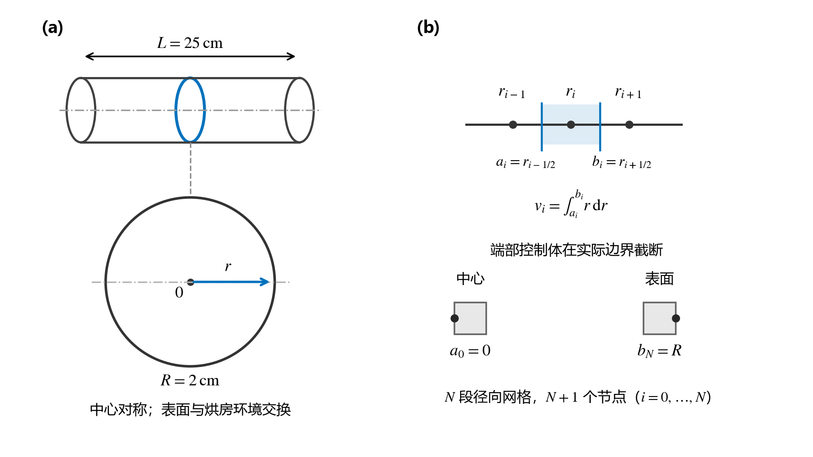
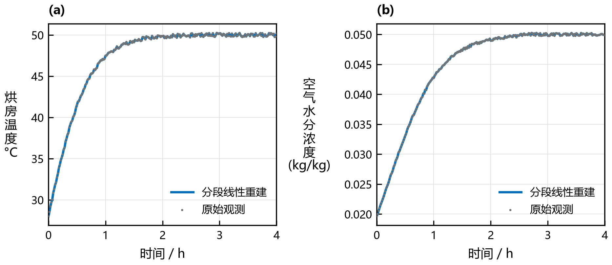
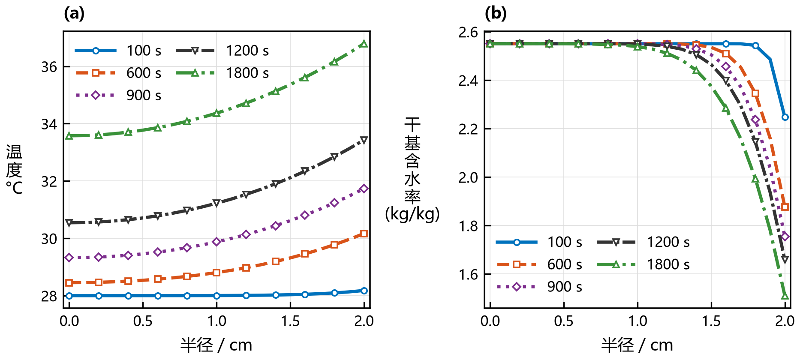
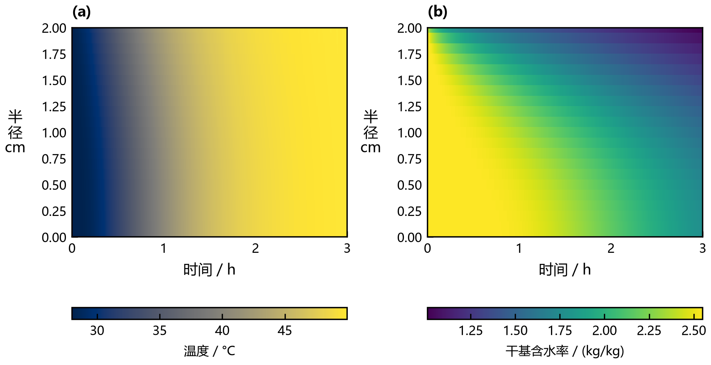
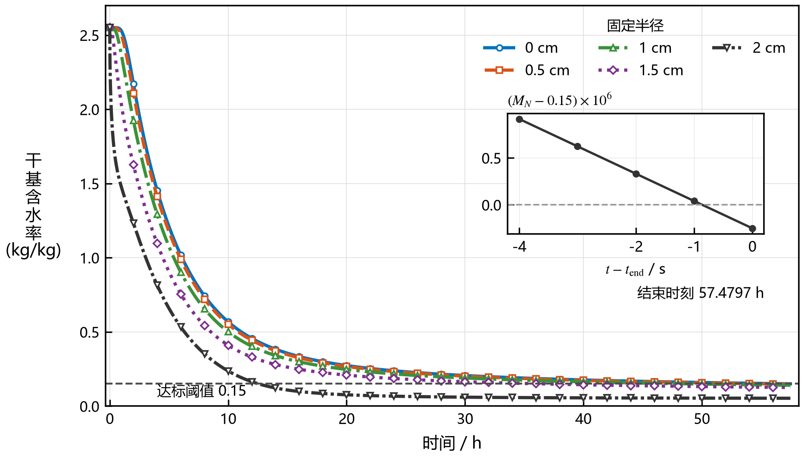
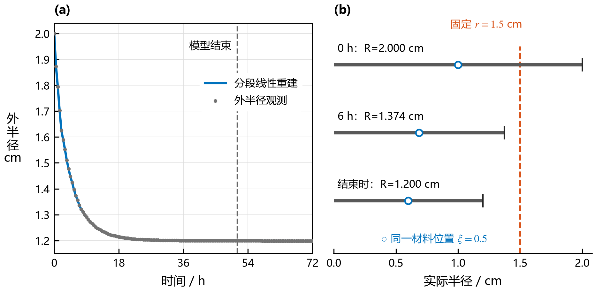
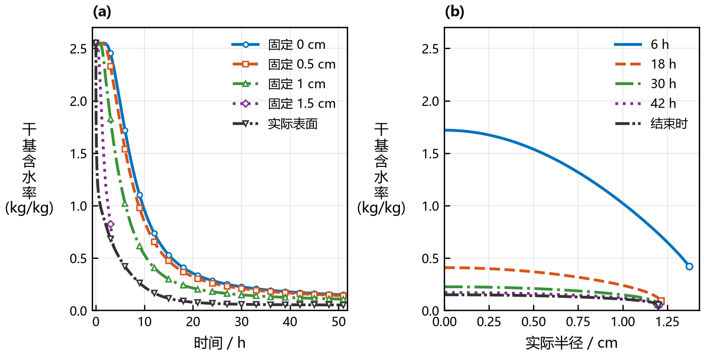
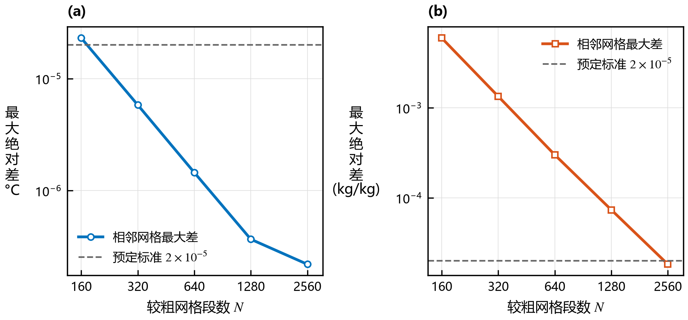

# 论文图件与使用入口

八组图已插入四问队友讲解稿；这是供队伍选用的工作图件包。图号按各问内部编号，合稿时由队伍统一连续编号。

[A4图件预览册](figure_catalog.pdf) · [LaTeX预览册源文件](figure_catalog.tex) · [来源及变换记录](figure_sources.json)

所有图按15.8 cm宽设计。LaTeX建议使用PDF；Word可优先试用SVG，不兼容时用300 dpi PNG。正式题注由正文排版，勿截图复制预览册。

主曲线加粗至1.7—1.8 pt，纵轴中文逐字竖排、字形正立，单位与数学式保持易读；图内不设描述性标题，仅保留子图编号及必要标注。离散曲线改用蓝、橙红、绿、紫、深灰，配合线型和标记区分，保持同一对象跨图一致。配色借鉴干燥领域论文以鲜明色相区分曲线的方式，具体色值按本图可读性选定；连续色场保留cividis/viridis。

参考了干燥领域论文[Brasiello等（2021）](https://doi.org/10.3303/CET2187033)中分面表达、观测标记和曲线区分的方式；本图包全部数据与几何关系来自本项目，没有移用该论文的数值或图像。

## 圆柱中部径向模型与控制体

[PDF](fig01_radial_model.pdf) · [SVG](fig01_radial_model.svg) · [PNG](fig01_radial_model.png)

圆柱及网格均为示意。控制体按径向位置截取圆环，中心与表面控制体分别截断于0与R；图中少量节点不代表正式网格数。

## 烘房环境观测与分段线性重建

[PDF](fig02_environment.pdf) · [SVG](fig02_environment.svg) · [PNG](fig02_environment.png)

两幅图分别表示附件1的温度与空气水分浓度。灰点为241个原始观测，蓝线为分段线性重建。图示0—4 h；Q1仅使用前0.5 h，Q2结果展示前三小时。

## Q1预热阶段温度与含水率的径向响应

[PDF](fig03_q1_profiles.pdf) · [SVG](fig03_q1_profiles.svg) · [PNG](fig03_q1_profiles.png)

分别绘制100、600、900、1200、1800 s时的温度和干基含水率，均为题目规定的表格时刻。900、1200 s的剖面补充中间阶段的径向变化。每条曲线连接21个规定半径的未舍入计算值，稀疏标记用于识别曲线，未额外拟合。

## Q2前三小时温度与含水率的时空分布

[PDF](fig04_q2_fields.pdf) · [SVG](fig04_q2_fields.svg) · [PNG](fig04_q2_fields.png)

横轴为时间，纵轴为实际半径，色标分别表示温度与干基含水率。色场取前三小时逐秒保存的21个规定半径值，采用邻近色块显示；它不表示全部细网格节点的逐秒快照。

## Q3完整干燥过程与全域达标判定

[PDF](fig05_q3_drying.pdf) · [SVG](fig05_q3_drying.svg) · [PNG](fig05_q3_drying.png)

主图为五个固定半径的干基含水率历程。小图的M_N为全10241节点的最大含水率，206926 s尚未严格低于0.15，206927 s首次达标。微小差值只解释数值终点判据，不代表实际干燥时长具有秒级准确度。

## Q4外半径观测与收缩坐标对应

[PDF](fig06_q4_geometry.pdf) · [SVG](fig06_q4_geometry.svg) · [PNG](fig06_q4_geometry.png)

左图展示附件2的0—72 h外半径观测，虚线标出当前模型结束时刻。右图按均匀径向缩放假设绘制r=R(t)ξ：同一ξ的位置随半径移动，固定r=1.5 cm在6 h时已位于材料外。三行仅排列时刻，内部位置不是实测数据。

## Q4收缩条件下的含水率演变

[PDF](fig07_q4_profiles.pdf) · [SVG](fig07_q4_profiles.svg) · [PNG](fig07_q4_profiles.png)

左图采用固定物理位置和实际移动表面的含水率；固定位置移出材料后断线。右图为6、18、30、42 h及结束时的完整细网格剖面，横坐标是实际半径，各曲线端点为当时表面R(t)。

## Q1网格加密的数值一致性

[PDF](fig08_grid_convergence.pdf) · [SVG](fig08_grid_convergence.svg) · [PNG](fig08_grid_convergence.png)

比较N与2N网格在全部1800×21个规定输出点上的最大绝对差。温度和含水率分别显示，虚线为已有预定检验标准。相邻网格差用于评价数值一致性，不是连续解误差的严格上界；本图只对应Q1。

