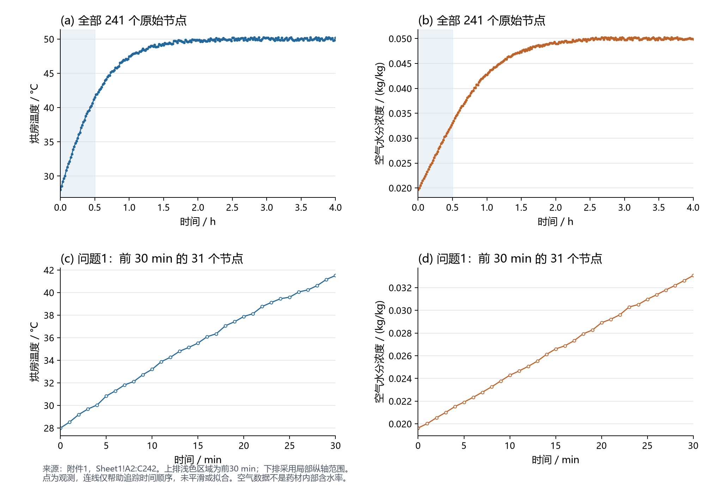
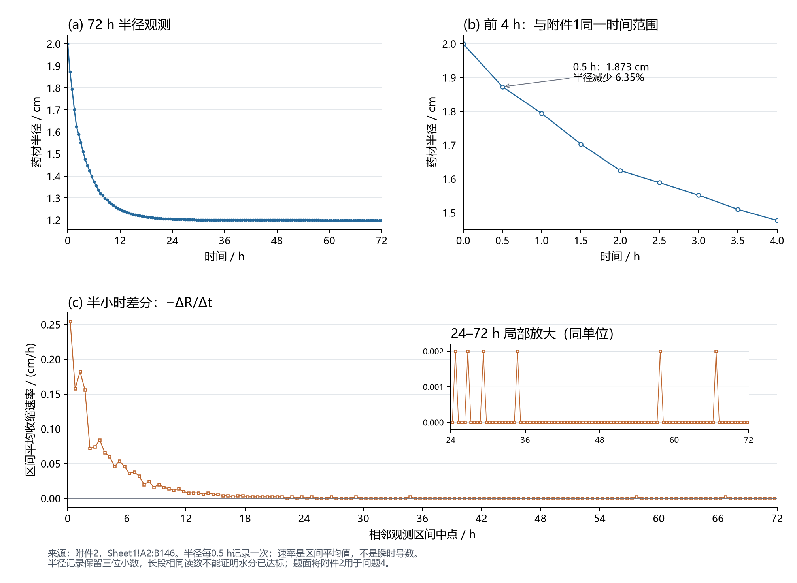

# 附件可视化与信息审阅

日期：2026-09-10。用途：在模型选择前检查原始数据形态、时间尺度和假设风险。本文是输入诊断，不是药材内部温湿场计算或模型验收。

## 图表与数据

附件1：Sheet1!A2:C242，共241个节点，0–4 h，每60 s一次。上排展示全部节点，下排展示问题1的前30 min，共31个节点；下排使用局部纵轴。两个变量分图显示，避免双纵轴造成同步幅度相近的错觉。

附件2：Sheet1!A2:B146，共145个节点，0–72 h，每0.5 h一次。展示全程半径、前4 h半径和相邻区间平均收缩速率；24–72 h速率另设局部放大。速率按 −(R[i+1]−R[i])/(t[i+1]−t[i]) 计算并标在区间中点，单位cm/h，不能当作瞬时导数。

原始点全部保留，没有去噪、拟合、删除或填补数据。连线只用于追踪时间顺序，不能证明节点之间线性变化。附件3是待填写结果模板，没有观测序列可供探索。

## 数据直接显示什么

| 观察 | 数据依据 | 对建模的影响 |
|---|---|---|
| 前30 min环境仍在明显变化 | 温度28→41.513°C，空气水分浓度0.01963→0.03307 kg/kg；31个节点均递增 | 问题1需要随时间变化的边界；不能全程用50°C代替原始升温过程 |
| 后期接近平台但不是常数 | 3–4 h温度49.757–50.236°C，空气水分浓度0.04975–0.05024 kg/kg | 保留观测波动；4 h以后如何延长边界仍须单独定义，图形不能证明无限期恒定 |
| 附件2前30 min已有可见径向收缩 | 半径2.000→1.873 cm，减少0.127 cm，即6.35% | 提示不能仅凭时段短认定收缩可忽略；两附件实验配对身份未确认，对Q1温湿场的误差也未量化；Q1固定半径按分问简化处理 |
| 半径总体单调不增，但区间速率并非逐段下降 | 52段下降、92段相同、0段增加；前两段速率0.254、0.158 cm/h，下一段回升到0.182 cm/h | 不应先强制一个平滑单指数或把每次速率回升命名为物理阶段 |
| 后期存在长段相同读数 | 35–57.5 h记录为1.200 cm；之后仍降至72 h的1.198 cm | 记录保留三位小数，差分会出现0或0.002 cm/h；不知道仪器误差，不能宣称真实瞬时速率严格为零 |
| 大部分观测收缩发生较早 | 24 h半径1.204 cm，已发生本次72 h总半径变化的99.25%；72 h总降幅40.10% | 支持在早期保留更细的数值分辨率；不说明含水率已达标，也不等于无限时间最终收缩 |

0.5、1、2、3、4 h分窗只用于描述与阅读；没有进行变点检验，不能称为从数据识别出的干燥阶段。前30 min的半径只有起点和终点两个观测，不能据此选择这一时段内的曲线形状。

## 图形还不能回答什么

附件1的空气湿含量不是药材内部干基含水率。不能拿它和半径直接作“失水—收缩”回归。两个附件虽有0–4 h的9个共同时间点，但没有样品或批次标识，不能仅凭时间相同认定为逐点配对的同一次实验。

若后续获得同一样品的固体质量或干基含水率，才适合画R/R0对C/C0并标注时间方向，检查阶段性及非线性。人参整根成像研究提供了这种实验思路，但不能替代本题缺失的固体含水数据（[领域研究审阅](../references/Q1/domain_research.md)，DOM-03）。仅凭半径曲线也无法确认结壳、孔隙塌陷等微观机制。

半径改变不直接等于失水比例。圆柱体满足V/V0=(R/R0)²(L/L0)，而附件没有长度变化数据；即使取得体积，还需要干物质质量、密度和孔隙关系，才能建立质量守恒。附件2的收缩在题面中用于问题4，不据此悄悄改变问题1的规定输出域。

## 核验与复现

- 两份原始工作簿读取前后的SHA-256一致；全文身份与逐窗数值保存在[诊断数据](../output/diagnostics/input_stats.json)，与`planning/input_inventory.json`一致。
- 独立复核直接重新读取附件，完成636项数值及身份比较，未发现不一致。无缺失点、重复时刻或逆序时间；详见[环境审计](ENV/data_audit.md)。
- 已实际打开两张PNG检查中文、坐标、节点、图注及裁切；后期速率局部图修改后重新渲染并复查通过。SVG同时输出，可用于后续排版；尚未嵌入论文，也未进行论文页面审阅。
- 复现：项目环境执行`python -B scripts/plot_inputs.py`。生成器不修改附件，只写本诊断目录；没有运行干燥求解器。

图形诊断用于判断边界如何随时间变化、问题4收缩如何处理，以及哪些数据需要保留。问题1仍按题给条件推进；题外因素只在模型假设中简述。见[问题1候选比较](Q1/model_candidates.md)。正式选择与下一动作以`.modeling/state.json`为准。
